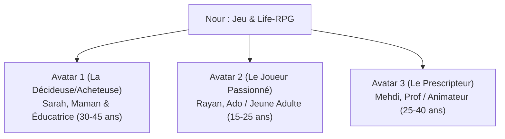

# 🎯 GUIDE STRATÉGIQUE : TROUVER ET ENGAGER TES AVATARS CIBLES SUR LES RÉSEAUX
### *Application « Nour : Jeu Islamique & Adab » (La Voie de la Sagesse)*

---

## 🌟 1. LES 3 AVATARS CIBLES MAJEURS

---

### 🧕 AVATAR 1 (Cœur de cible & Acheteur) : **« Sarah, la Maman Consciente »**
*Elle est celle qui télécharge l'application pour ses enfants et achète les packs de chapitres.*

* **Âge :** 30 à 45 ans.
* **Situation :** Mère de 2 à 4 enfants (âgés de 7 à 16 ans), active ou au foyer, attachée à l'éducation islamique et à l'Adab.
* **Ses Douleurs & Frustrations :**
  - Ses enfants passent trop de temps sur les écrans (Roblox, Fortnite, YouTube, TikTok).
  - Elle craint la toxicité, la violence et les valeurs contraires à l'éthique musulmane.
  - Difficulté à transmettre la patience (*Sabr*), la politesse (*Adab*) et l'amour de la Sunnah de manière captivante.
* **Son Désir Profond :**
  - Trouver un jeu **100% sain, sans musique illicite, sans vulgarité**, qui enseigne les nobles caractères.
  - **Le facteur magique :** Un jeu qui pousse son enfant à **ranger son lit**, **aider à la maison** et **dire le Salām** dans la vraie vie !
* **Où la trouver sur les réseaux :**
  - **Instagram :** Comptes de parentalité positive musulmane, homeschooling, recettes de famille, créatrices de contenu maman musulmane.
  - **Groupes WhatsApp / Telegram :** Cercles de mamans, groupes d'écoles, madrassas.
  - **Facebook :** Groupes « Mamans musulmanes », « Éducation bienveillante & Islam ».
* **Accroches / Hooks qui captent son attention :**
  > *« Marre que tes enfants jouent à des jeux qui détruisent leur comportement ? Voici le 1er RPG qui les pousse à ranger leur chambre et appliquer la Sunnah ! »*

---

### 🎮 AVATAR 2 (L'Utilisateur & Joueur Actif) : **« Rayan, le Jeune en quête d'élévation »**
*Il est le joueur qui s'identifie à Othmân et vit l'aventure initiatique.*

* **Âge :** 15 à 24 ans (Collège, Lycée, Étudiant).
* **Profil :** Passionné d'animés/mangas, de jeux vidéo rétro/RPG (Zelda, Pokémon), sensible au développement personnel et à sa spiritualité.
* **Ses Douleurs & Frustrations :**
  - Se sent parfois seul, incompris, bloqué par la timidité ou le doute intérieur (*Waswâs*).
  - Culpabilité de perdre son temps dans des futilités numériques.
  - Recherche du contenu musulman moderne, esthétique, sans être moralisateur ou austère.
* **Son Désir Profond :**
  - Vivre une aventure épique avec une belle histoire, du pixel-art soigné et une bande-son apaisante.
  - Développer sa discipline, sa maîtrise de soi (*Hilm*) et sa force morale.
* **Où le trouver sur les réseaux :**
  - **TikTok :** FYP Islam, rappels esthétiques, gaming éthique, animation, citations de sagesse.
  - **YouTube Shorts / Instagram Reels :** Vidéos d'ambiance Lo-Fi, récits inspirants, combats intérieurs.
  - **Discord & X (Twitter) :** Communautés mangas/animés musulmans, serveurs de productivité.
* **Accroches / Hooks qui captent son attention :**
  > *« Tu te sens invisible ou bloqué par tes doutes ? Ce jeu t'apprend à terrasser le Waswâs comme dans un vrai RPG. »*

---

### 📚 AVATAR 3 (Le Prescripteur) : **« Mehdi, l'Enseignant & Éducateur »**
*Il recommande l'application aux élèves, aux parents et aux associations.*

* **Âge :** 25 à 40 ans (Professeur d'arabe, d'éducation islamique, animateur de centre de loisirs ou d'association).
* **Ses Douleurs :** Manque cruel d'outils numériques modernes et ludiques pour capter l'attention des jeunes générations.
* **Son Désir :** Un support pédagogique validé, avec des sources authentiques (Hadiths de Bukhari/Muslim, versets du Coran) et des quiz interactifs.
* **Où le trouver :** LinkedIn, Telegram, forums d'éducateurs, réseaux des mosquées.

---

## 📱 2. MATRICE DES FORMATS PAR RÉSEAU SOCIAL

| Réseau Social | Avatar Visé | Format Idéal | Type de Contenu Gagnant |
| :--- | :--- | :--- | :--- |
| **TikTok** | Rayan (Ado/Jeune) | Vidéo 15-30s verticale | **Extrait de gameplay percutant** : Le combat contre le Waswâs, le choix moral du marché. |
| **Instagram Reels** | Sarah (Maman) + Rayan | Vidéo esthétique 30-45s | **Avant / Après** : L'enfant qui joue dans l'app ➔ L'action accomplie dans la vraie vie (ranger son lit / verre d'eau). |
| **Instagram Carrousels** | Sarah (Maman) & Mehdi | Carrousel 5-7 slides | *« 5 raisons pour lesquelles ce jeu révolutionne l'éducation de nos enfants »* (Slide 1 choc, Slide 2-6 valeur, Slide 7 CTA). |
| **WhatsApp / Telegram** | Sarah (Maman) | Message court + Vidéo Teaser | Message chaleureux et bienveillant à partager dans les groupes de famille/mamans avec le lien direct Google Play. |
| **YouTube Shorts** | Tout public | Vidéo 45-60s | Récit conté avec la voix de Noura : *« L'histoire d'Othmân face au doute... »* |

---

## 🎬 3. LES 3 SCRIPTS VIRAUX PRÊTS À TOURNER / PUBLIER

### 🔹 Script 1 (Pour TikTok / Reels - Angle Gaming & Spiritualité)
* **Hook (0-3s) :** *(Texte à l'écran + Voix)* « Tu n'as jamais vu un jeu vidéo musulman comme celui-là... »
* **Développement (3-15s) :** *(Montrer le gameplay d'Othmân face à l'ombre du Waswâs)* « Dans *Nour*, tu incarnes Othmân. Chaque fois que le doute t'attaque, tu dois brandir le Sabr et la Discipline. Mais le plus fou ? »
* **Climax (15-22s) :** *(Montrer l'écran de quête réelle)* « Pour gagner de l'XP et avancer, le jeu te demande d'accomplir une vraie Sunnah dans ta vraie vie : ranger ton espace, invoquer ou sourire à un passant. »
* **CTA (22-25s) :** « Télécharge gratuitement *Nour* sur le Play Store ! Lien en bio. »

---

### 🔹 Script 2 (Pour Instagram - Angle Parentalité & Éducation)
* **Hook (0-3s) :** « Si vos enfants passent leur journée sur les jeux vidéo, montrez-leur ceci ! »
* **Développement (3-18s) :** « J'en avais marre des jeux violents et vides de sens. J'ai découvert *Nour : La Voie de la Sagesse*. C'est un RPG poétique où l'enfant apprend l'Adab, la maîtrise de la colère et la bienveillance à travers une quête immersive. »
* **Preuve (18-25s) :** « 100% éthique, sourcé du Coran et de la Sunnah, et sans aucune mauvaise influence. »
* **CTA :** « Dispo sur Android (Google Play Store) et sur le web ! »

---

### 🔹 Script 3 (Message type pour WhatsApp / Groupes)
> *As-salāmu ʿalaykum wa rahmatullāh à tous !* 🌿  
> Je vous partage une magnifique pépite pour les enfants et les jeunes : **Nour (نُور)**, un jeu d'aventure RPG éthique et éducatif.  
>  
> ✨ **Ce qui le rend unique :** Pour faire progresser le héros, le joueur doit valider de vraies bonnes actions au quotidien (ranger son lit, appliquer l'adab, maîtriser sa colère, pardonner).  
>  
> 📲 **Téléchargement gratuit sur Google Play Store :** [Lien vers Play Store]  
> 🌐 **Ou jouable sur navigateur :** https://nour-le-jeux.web.app  
>  
> *N'hésitez pas à faire tourner pour soutenir ce beau projet éthique !* 🤍
