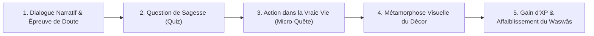

# NOUR : LE JEU — RETROUVE TA LUMIÈRE
## Dossier Intégral de Référence : Concept, Mécanismes & Retranscription Complète des Dialogues

---

> [!NOTE]
> **Préambule & Destination de ce Document : L'Œuvre Intégrale Accessible à Tous**  
> Ce document est conçu pour toute personne qui souhaite découvrir, analyser, lire ou enseigner **Nour : Le Jeu** sans nécessairement y jouer directement sur un écran tactile ou un clavier (lecteurs de récits initiatiques, éducateurs, parents, personnes malvoyantes via synthèse vocale, psychologues, imams ou partenaires).  
> Il retranscrit **avec une fidélité absolue l'intégralité de l'œuvre dans son état actuel le plus abouti (v2.0 — Trilogie Complète)** :
> - Son âme, sa vision éducative et ses mécanismes novateurs de « Life-RPG » (relier le virtuel au réel).
> - La psychologie de ses personnages et la double jauge réactive en temps réel (**Nour** / Lumière vs **Waswâs** / Doute).
> - La mécanique du **Poteau aux Chemins** rythmant le cycle circadien (1 Chapitre = 1 Journée de vie).
> - **Le texte intégral, réplique par réplique, des trois grands chapitres du jeu** :
>   * **Chapitre 1 : Le Premier Pas vers l'Autre** (L'Éveil, la timidité, le Salām, le refus, le don secret et le jardin réhabilité — Scènes 1 à 9).
>   * **Chapitre 2 : Le Chemin du Hilm** (La colère, l'injustice au marché, les grenades renversées, l'eau des ablutions, le pardon noble ou la prière secrète, et le duel contre le feu intérieur — Scènes 10 à 16, avec les deux branches 14A et 14B).
>   * **Chapitre 3 : La Montagne Intérieure** (La maladie, la fièvre, l'attelle, la Talbîna et le miel, la cueillette fraternelle sous les amandiers ou l'étude du manuscrit d'Ayyūb, le bouillon chaud du voisin, la graine sous terre, et le triomphe de la résilience — Scènes 17 à 25, avec les deux branches 20A et 20B).
> - Tous les **choix interactifs d'attitude**, tous les **Quiz de sagesse sourcés (Coran & Hadiths authentiques en arabe)**, toutes les **Actions concrètes dans le monde réel** et les **Duels spirituels interactifs de fin de chapitre**.
> - Le guide complet pour installer et utiliser le fichier Android autonome **`Nour-LaVoieDeLaSagesse-debug.apk`**.

---

## 📑 SOMMAIRE GÉNÉRAL DU DOSSIER
- **[PARTIE I : L’ÂME DU JEU & LA VISION FONDATRICE](#partie-i--lâme-du-jeu--la-vision-fondatrice)**
  - 1. Qu'est-ce que *Nour : Le Jeu* ?
  - 2. Le Public Visé
- **[PARTIE II : LES MÉCANISMES DU JEU (GAMEPLAY & LIFE-RPG)](#partie-ii--les-mécanismes-du-jeu-gameplay--life-rpg)**
  - 1. La Boucle de Gameplay Principale (« Play-to-Act »)
  - 2. La Double Jauge Permanente (Nour Dorée vs Waswâs Violet)
  - 3. Le Moteur Réactif de Doute dans les Dialogues
  - 4. La Boucle Centrale « Nouveau Jour » & Le Poteau aux Chemins
  - 5. Les Duels Spirituels Interactifs de Climax
- **[PARTIE III : LES PERSONNAGES & LEURS SYMBOLES](#partie-iii--les-personnages--leurs-symboles)**
  - Othmân, Noura, Le Vieux Sage, Le Waswâs, Les Villageois, Le Marchand, Le Jeune à l'Attelle, L'Apothicaire
- **[PARTIE IV : SCRIPT INTÉGRAL — CHAPITRE 1 : « LE PREMIER PAS VERS L'AUTRE »](#partie-iv--script-intégral-scène-par-scène-chapitre-1)**
  - Scènes 1 à 9, Duel contre le Grand Waswâs, Épilogue du Jour 1
- **[PARTIE V : SCRIPT INTÉGRAL — CHAPITRE 2 : « LE CHEMIN DU HILM »](#partie-v--script-intégral-scène-par-scène--chapitre-2--le-chemin-du-hilm)**
  - Scènes 10 à 16, Choix de Silence/Paix, Ablutions fraîches, Bifurcation (Voie 14A Marché / Rifq vs Voie 14B Prière secrète sous la treille), Duel en 6 manches, Épilogue du Jour 2
- **[PARTIE VI : SCRIPT INTÉGRAL — CHAPITRE 3 : « LA MONTAGNE INTÉRIEURE »](#partie-vi--script-intégral-scène-par-scène--chapitre-3--la-montagne-intérieure)**
  - Scènes 17 à 25, Charte éthique médicale, L'Attelle, Remèdes prophétiques, Bifurcation sublimée (Voie 20A Amandiers vs Voie 20B Manuscrit d'Ayyūb), Lanterne, Larmes permises, Bouillon de solidarité en cuisine, Graine sous terre, Duel contre l'Abandon, Épilogue
- **[PARTIE VII : SYNTHÈSE THÉOLOGIQUE EXHAUSTIVE (18 SOURCES AUTHENTIQUES)](#partie-vii--synthèse-théologique-exhaustive-des-sources-authentiques-chapitres-1-2--3)**
- **[PARTIE VIII : BILAN TECHNIQUE, GUIDE DE L'APK & ACCÈS UNIVERSEL](#partie-viii--bilan-technique-guide-de-lapk--accès-universel)**
  - Guide d'installation APK Android, Accès Web Firebase, Guide pour malvoyants et éducateurs

---

# PARTIE I : L’ÂME DU JEU & LA VISION FONDATRICE

## 1. Qu'est-ce que *Nour : Le Jeu* ?
*Nour* (« Lumière » en arabe — نُور) est un jeu de rôle narratif et initiatique qui réconcilie l'univers du jeu vidéo rétro (pixel-art soigné, paysages inspirés des contes orientaux et de la poésie du studio Ghibli) avec **le développement personnel, l'éthique musulmane (*Adab*) et l'action concrète dans le monde réel**.

Contrairement aux jeux vidéo classiques qui enferment le joueur dans une bulle virtuelle où l'on accumule des richesses fictives, *Nour* repose sur un principe inversé : **le jeu n'a de valeur que s'il transforme la vie réelle du joueur**.  
Chaque palier narratif, chaque épreuve traversée par le jeune héros Othmân renvoie le joueur à sa propre existence : ranger son lit au réveil, boire avec calme et gratitude, saluer un inconnu sans timidité, accueillir un refus sans rancœur, purifier son intention secrète ou contempler les bienfaits qu'il possède déjà.

## 2. Le Public Visé
- **Enfants et Adolescents** : Pour leur donner le goût de la bienveillance, de la discipline quotidienne, et leur apprendre à désamorcer la petite voix intérieure de l'auto-sabotage et du doute (*Waswâs*).
- **Familles et Parents** : Un support éducatif sain, poétique, sans violence, sans écran addictif, ancré dans les sources authentiques du Coran et de la Sunnah.
- **Adultes en quête de sens** : Une aventure douce et méditative qui fait écho aux doutes universels de l'être humain face aux choix de vie, aux échecs et au regard d'autrui.

---

# PARTIE II : LES MÉCANISMES DU JEU (GAMEPLAY & LIFE-RPG)

## 1. La Boucle de Gameplay Principale (« Play-to-Act »)
Le jeu s'articule autour d'une progression en 3 grands chapitres narratifs (25 scènes majeures et 4 embranchements parallèles de choix éthiques) le long d'une carte d'ascension montagnarde (*Roadmap*).



1. **Immersion & Dialogue** : Othmân traverse un lieu et fait face à un blocage intérieur (peur, orgueil, timidité, blessure d'amour-propre, déception).
2. **Le Quiz d'Apprentissage** : Une notion de sagesse est introduite par Noura (sa mère et guide). Le joueur répond à un quiz interactif sourcé (Coran ou Hadith). Répondre juste rapporte **+25 XP** et affaiblit le Waswâs (**-15 Doute**). Répondre faux alimente le Waswâs (**+15 Doute**) et oblige à relire pour comprendre.
3. **L'Action Réelle (Life-RPG)** : Le jeu met l'aventure en pause et demande au joueur d'accomplir un geste physique dans son quotidien (boire un verre d'eau selon la Sunnah, ranger son lit, faire une bonne action secrète).
4. **La Métamorphose Dynamique du Décor** : Dès que l'action est validée, l'environnement visuel se métamorphose sous les yeux du joueur (la chambre en désordre devient impeccablement rangée, les villageois méfiants décroisent les bras et sourient, le ruisseau encombré se met à couler d'une eau limpide).
5. **Progression d'XP & Portes Spirituelles** : L'XP cumulée débloque les scènes suivantes. Si le joueur n'a pas assez médité les notions, une *Porte Spirituelle* l'invite à réviser le Savoir pour fortifier son cœur avant de poursuivre.

---

## 2. La Double Jauge Permanente dans l'En-Tête

L'en-tête du jeu (*PixelioHeader*) affiche **deux jauges vivantes et rivales**, visibles sur tous les écrans y compris sur smartphones étroits :

```text
┌────────────────────────────────────────────────────────────────────────┐
│ [AVATAR]  [NIV. 1] 180/500 XP (Or) ───►  [🌑 WASWÂS] 15/100 (Violet)  │
└────────────────────────────────────────────────────────────────────────┘
```

1. **La Jauge de Lumière d'Othmân (Dorée)** :
   - Reflète la maturité, l'élévation spirituelle et l'expérience accumulée (de Niveau 1 « Le Premier Pas » à Niveau 4 « Cœur Éveillé »).
   - Augmente lors de chaque bonne réponse aux quiz, chaque action réelle validée et chaque quête quotidienne accomplie.
   - S'accompagne d'un décompte progressif fluide (*roll-up*) et d'un envol d'orbes dorées.

2. **La Jauge d'Ombre du Waswâs (Violette)** :
   - Reflète l'emprise du doute, de la peur, de la rancœur et de l'hésitation sur l'esprit d'Othmân.
   - **Prend de l'XP en direct à chaque réplique de doute prononcée par Othmân** (+10 à +20 Doute).
   - **Régresse dès qu'Othmân ou le joueur pose un acte noble** (-10 à -20 Doute) : récitation de l'Istiʿādhah, salutation paisible du Salām, patience face au rejet (*Sabr*), service désintéressé (*Niyyah*) ou gratitude active (*Shukr*).
   - S'accompagne d'une impulsion violette néon, d'un badge flottant animé (`+15 Doute 🌑`) et d'un son ténébreux distinctif.

---

## 3. Le Moteur Réactif de Doute dans les Dialogues
Dans la plupart des jeux, le texte des dialogues est passif. Dans *Nour*, **chaque parole a un poids sur l'âme** :
- Dès qu'Othmân avoue sa peur ou son sentiment d'invisibilité, le Waswâs s'en nourrit instantanément à l'écran.
- Un toast flottant apparaît au centre supérieur de l'écran avec la raison spirituelle (ex: `🌑 +15 Doute | Le murmure du Waswâs résonne en Othmân` ou `✨ -20 Doute | L'Istiʿādhah dissipe l'Ombre !`).
- Le système audio Web Audio API joue une onde descendante en dent-de-scie lors d'une montée d'ombre, et une note pure scintillante lors d'une purification.

---

## 4. La Boucle Centrale « Nouveau Jour » & Le Poteau Hub de Progression Inter-Chapitres

Une avancée majeure de l'architecture narrative de *Nour* est que **chaque chapitre correspond à une véritable journée vécue**.  
Le jeu ne se contente pas d'enchaîner des niveaux de manière artificielle : il installe un **cycle circadien initiatique** où chaque journée apporte son épreuve, ses apprentissages, sa victoire sur l'ombre, et s'achève par le repos avant le réveil d'un matin nouveau.

### A. La Structure Fondamentale du Cycle Circadien

```text
                     NOUR : LE CYCLE CIRCADIEN
                                │
                          🌅 NOUVEAU JOUR (L'Aube)
                                │
                          🪧 LE POTEAU AUX CHEMINS (Hub de Progression)
                                │
                     ┌──────────┴──────────┐
                     │                     │
                Chapitre terminé      Chapitre verrouillé
                (Rejouable ✓)               🔒
                     │                     │
                     ▼                     │
              ✨ NOUVELLE ROUTE            │
              (Chapitre Suivant)           │
                     │
                     ▼
                Noura & Le Pas de Départ
                     │
                     ▼
                Épreuve Humaine & Waswâs (Doute)
                     │
                     ▼
                Apprentissage & Quiz de Sagesse
                     │
                     ▼
                Action Réelle dans la Vraie Vie (Life-RPG)
                     │
                     ▼
                Gain d'XP & Dissolution de l'Ombre
                     │
                     ▼
                Climax du Soir (Duel de Résilience)
                     │
                     ▼
              🌅 AUBE DU LENDEMAIN : NOUVEAU JOUR
```

### B. Le Poteau aux Chemins : Le Menu Narratif Diégétique de NOUR
Dans *Nour*, la carte des mondes n'est pas un banal menu abstrait superposé à l'écran. Elle est **matérialisée physiquement dans le monde du jeu par le grand Poteau indicateur en chêne sculpté** situé au croisement des sentiers (Scène 2).

Ce poteau ne répond pas seulement à la question *« Où va Othmân ensuite ? »*, mais à une question bien plus stimulante pour le joueur :
> **« Quelle nouvelle aventure veux-tu découvrir aujourd'hui ? »**

```text
             🪧 LE POTEAU AUX CHEMINS (Menu Narratif d'Anthologie)

    ┌──────────────────────────────────────────────────────────────────┐
    │  🌿 Le chemin du Hilm                                            │
    │     CHAPITRE 2 🔓 — La Colère, la Provocation & la Douceur       │
    │                                                                  │
    │  🌙 Le chemin du Tawakkul                                        │
    │     CHAPITRE 3 🔒 — La Prise de Décision & la Confiance en Dieu  │
    │                                                                  │
    │  ☀️ Le chemin du Shukr                                           │
    │     CHAPITRE 4 🔒 — La Réussite, l'Abondance & la Gratitude      │
    │                                                                  │
    │  ──────────────────────────────────────────────────────────────  │
    │  ✓ « Se faire des amis » — Chapitre 1 : Les Rencontres           │
    │     VALIDÉ [Rejouable] — Vaincre la Solitude & Tendre la Main    │
    └──────────────────────────────────────────────────────────────────┘
```

- **Au Jour 1** : Seul le panneau « Se faire des amis » (Chapitre 1) est actif.
- **Au Jour 2 (après l'Aube)** : Le joueur revient devant le poteau et découvre :
  > **✨ NOUVELLE AVENTURE DÉVERROUILLÉE : LE CHEMIN DU HILM (CHAPITRE 2).**

---

### C. La Règle Officielle de NOUR : Des Aventures Autonomes unifiées par le Moteur

> [!IMPORTANT]
> ### 🏆 RÈGLE OFFICIELLE DE STRUCTURE DES CHAPITRES
> **Chaque chapitre est une aventure autonome et complète.**  
> Il possède son propre début, son propre conflit humain, sa transformation morale, ses apprentissages de sagesse et son propre climax.  
> Les chapitres ne sont pas obligés de suivre une progression pédagogique scolaire ou linéaire des notions islamiques.  
> Ils partagent cependant **le même univers continu, les mêmes mécaniques fondamentales et la même philosophie** : *apprendre dans le jeu, agir dans la vraie vie, puis revenir pour progresser.*  
> La fin d'un chapitre débloque une nouvelle route au poteau de direction, permettant d'accéder à une nouvelle aventure.

#### Les 3 Piliers de l'Architecture NOUR :
1. **L'Univers est continu** : Othmân, Noura, les décors de la région, la présence tapie du Waswâs, le niveau global du joueur, son Codex et ses arbres de vertus.
2. **Les Mécaniques sont continues** : Le moteur NOUR (Header dual Doré/Violet, DialogueBox réactive, Actions réelles Life-RPG, Quiz sourcés, Codex du Savoir, Pont de Nour, Duel de Climax).
3. **Chaque chapitre raconte une histoire complète** :
   ```text
   Début ──► Problème Humain ──► Épreuve du Waswâs ──► Action Réelle ──► Climax ──► Histoire Résolue
   ```

---

### D. Liberté d'Écriture : « Une Situation Humaine ➔ Des Notions de Sagesse »

Au lieu d'enfermer le jeu dans un cursus magistral rigide (*Chapitre 1 = Sabr, Chapitre 2 = Hilm, Chapitre 3 = Tawakkul...*), NOUR adopte une approche dramaturgique vivante : **partir d'une situation humaine universelle pour faire intervenir naturellement les sagesses spirituelles adaptées**.

| Situation Humaine Concrète | Chapitre & Aventure | Notions Clés Mobilisées |
| :--- | :--- | :--- |
| **La solitude & la timidité** | **Chapitre 1** : *Se faire des amis* | *Taʿāruf, Salām, Adab, Sabr, Niyyah, Shukr, ʿIlm* |
| **La colère, l'injustice, la provocation** | **Chapitre 2** : *Le chemin du Hilm* | *Hilm (Maîtrise & Douceur), ʿAfw (Pardon), Adab* |
| **La décision difficile & l'incertitude** | **Chapitre 3** : *Le chemin du Tawakkul* | *Prise des moyens (Asbāb) ➔ Action ➔ Tawakkul* |
| **L'abondance, le succès, la réussite** | **Chapitre 4** : *Le chemin du Shukr* | *Shukr (Reconnaissance active), Niyyah, Humilité* |
| **La maladie, la fatigue & l'interruption des projets** | **Chapitre 5** : *La Montagne Intérieure* | *Sabr, Tawakkul actif (soins), Duʿāʾ, Shukr, Dignité, Espoir* |
| **L'échec cuisant & le découragement** | *Aventure autonome future* | *Sabr (Endurance), Tawakkul, Redémarrage* |
| **La jalousie & la comparaison aux autres** | *Aventure autonome future* | *Shukr (Bienfaits reçus), Niyyah, Qalb Salīm* |
| **La faute, l'erreur ou le regret** | *Aventure autonome future* | *Tawbah (Retour sincère), Réparation du tort* |
| **Le besoin de reconnaissance & le paraître** | *Aventure autonome future* | *Ikhlās (Sincérité secrète), Détachement du regard d'autrui* |

**Avantages majeurs pour le joueur et la production :**
- **Idéal sur Mobile** : Un joueur peut reprendre le jeu au Chapitre 2 ou 4 et comprendre immédiatement l'enjeu dramatique sans dépendance narrative lourde.
- **Agilité Créative** : Pas besoin de planifier 20 chapitres de manière figée dès le Jour 1. Chaque chapitre est conçu comme une perle narrative autonome, testable et diffusable indépendamment.

---

### E. La Règle d'Or du Déverrouillage : L'Accomplissement, pas le Score
Un chapitre ne se débloque pas parce que le joueur a simplement accumulé des points ou « battu un boss ».  
Il se débloque parce qu'il a **mené à terme l'intégralité du parcours narratif, validé ses apprentissages de sagesse et accompli ses actions réelles**.  
Ce principe ancre une conviction profonde chez le joueur :
> **« Hier, j'ai résolu un conflit et grandi. Aujourd'hui, une nouvelle route m'attend. »**

---

### F. La Transition Matinale & Le Pont de NOUR Universel
Chaque nouveau chapitre commence au lever du soleil avec une transition poétique, brève et sans sermon :

```text
[NOURA] (Souriante)
Une nouvelle journée commence, Othmân.

[NOURA] (Regardant le poteau)
Tu as avancé hier. Aujourd'hui, un nouveau chemin t'attend.
```

> 🌉 **LE PONT DE NOUR (Noura s'adresse directement au joueur)** :  
> *« Et toi aussi qui accompagnes Othmân... chaque journée peut être un nouveau départ. »*

---

### G. L'Avantage Industriel pour la Production
Cette architecture modulaire résout avec brio le passage à l'échelle de *Nour* :  
Le **squelette technique du moteur reste 100% identique** (Header dual, DialogueBox réactive, Modales de Quiz et d'Actions réelles, Duel de Climax).  
Pour bâtir les chapitres suivants (Chapitre 2 : *Le Hilm*, Chapitre 3 : *Tawakkul*, Chapitre 4 : *Shukr*), il suffit d'alimenter les données :
1. Nouveaux décors pixel-art.
2. Nouvelles répliques et tiraillements d'Othmân face au problème du jour.
3. Nouvelles notions théologiques et Hadiths sourcés.
4. Nouvelles actions réelles concrètes dans le quotidien du joueur.
5. Nouvel avatar du Waswâs incarnant l'épreuve spécifique (Colère ardente pour le Hilm, Brouillard de l'hésitation pour Tawakkul, etc.).

---

---

## 5. Le Duel Spirituel Interactif du Climax (Scène 9)
Le combat final contre le **Grand Waswâs** au sommet de la montagne n'est pas un banal clic automatique, mais un **véritable affrontement de résilience** :

- **Jauges de combat en face-à-face** :
  - **Sérénité d'Othmân** : 100 PV (Barre verte & soleil ☀️).
  - **Emprise du Grand Waswâs** : 100 à 150 PV (Barre violette & lune 🌑, directement calculée selon le niveau de Waswâs accumulé par le joueur durant son périple !).
- **4 Manches d'Attaque & Riposte Spirituelle** :
  1. *Attaque du Doute et de la Solitude* ➔ Riposte requise : **L'Istiʿādhah** (*Aʿūdhu billāh*).
  2. *Attaque contre la Légitimité et le Savoir* ➔ Riposte requise : **La Science Authentique (*ʿIlm*)**.
  3. *Provocation à la Rancœur et à la Colère* ➔ Riposte requise : **La Maîtrise de Soi et la Douceur (*Hilm & Sabr*)**.
  4. *Le Murmure du Désespoir* ➔ Riposte requise : **La Confiance en Dieu et l'Action (*Tawakkul*)**.
- **Impacts en direct** : Une bonne riposte inflige des dégâts lumineux au Waswâs. Une mauvaise riposte ou une hésitation fait chuter la Sérénité d'Othmân.

---

## 6. L'Écran de Défaite & l'Option C (« Le Quiz du Hilm & Savoir »)
Si la Sérénité d'Othmân tombe à 0 face au Grand Waswâs :
- Le jeu ne punit pas le joueur avec un « Game Over » frustrant. Il propose un écran de méditation bienveillant :  
  *« Le Voile du Doute s'est refermé... Ton cœur a manqué de fermeté face aux illusions de l'Ombre. »*
- Deux options s'offrent au joueur :
  1. 🔄 **« Réessayer immédiatement »** : Réinitialise le duel pour retenter sa chance.
  2. 📖 **« Fortifier mon cœur (Quiz du Hilm & Savoir) »** : Ouvre les Quiz Islamiques avec priorité sur la catégorie **Hilm & Maîtrise de Soi**. Répondre aux questions prophétiques sur la maîtrise de la colère et la douceur redonne de la sérénité à Othmân et affaiblit le Waswâs avant de retourner au combat !

---

# PARTIE III : LES PERSONNAGES & LEURS SYMBOLES

### 1. Othmân (Le Jeune Voyageur)
- **Rôle** : Le protagoniste incarné par le joueur.
- **Psychologie** : Sensible, sincère, courageux mais souvent assailli par la timidité, la peur de déranger, le sentiment d'être invisible et la peur de l'échec.
- **Symbolisme** : Il représente l'être humain au seuil de sa jeunesse : plein de bonne volonté, mais entravé par ses propres voix d'auto-sabotage.

### 2. Noura (La Mère & Guide de Lumière)
- **Rôle** : La voix de la sagesse, de la tendresse et du discernement spirituel.
- **Pédagogie** : Elle ne donne jamais d'ordre brutal. Elle pose des questions maïeutiques qui poussent Othmân à observer, ressentir et comprendre par lui-même.
- **Symbolisme** : La transmission familiale et apaisée de la foi, vécue avec amour et constance.

### 3. Le Vieux Sage (La Narration)
- **Rôle** : Voix omnisciente qui ouvre et clôture les chapitres.
- **Symbolisme** : La mémoire vivante des générations passées, le garant de l'authenticité et de la profondeur spirituelle.

### 4. Le Waswâs & Le Grand Waswâs
- **Rôle** : Les antagonistes allégoriques.
- **Apparence** : Une brume violette ténébreuse, un vortex sombre tourbillonnant aux yeux perçants.
- **Nature** : Ils n'ont **aucun pouvoir physique ni matériel**. Ils ne font que souffler sur les fragilités humaines : *« Tu vas échouer »*, *« Ils vont te trouver bizarre »*, *« Tu n'es rien »*.
- **Symbolisme** : Le Shayṭān et les ruminations négatives qui cherchent à paralyser l'action noble.

### 5. Les Habitants du Village & Le Jeune Artisan
- **Rôle** : Les figures du monde extérieur.
- **Symbolisme** : La société avec sa diversité : la méfiance initiale (désamorcée par un sourire sincère) et le droit au refus (qui enseigne le détachement et la patience).

### 6. Le Marchand de Grenades (Chapitres 2 & 3)
- **Rôle** : L'homme du marché d'abord emporté par la colère suite au renversement de ses paniers par la mule, puis profondément touché par la douceur (*Ar-Rifq*) et l'aide désintéressée d'Othmân.
- **Symbolisme** : L'être humain sous le fardeau des dettes et de l'anxiété du gagne-pain. Sa métamorphose illustre le verset : *« Repousse le mal par ce qui est meilleur ; et voilà que celui avec qui tu avais une inimitié devient tel un ami chaleureux »* (Coran 41:34). Au Chapitre 3, c'est lui qui vient apporter le bouillon chaud réconfortant à Othmân alité !

### 7. Le Jeune Garçon à l'Attelle (Chapitre 3)
- **Rôle** : Le camarade blessé rencontré sur les marches de la mosquée, dont le bras gauche est solidement maintenu dans une attelle de bois et des bandes de lin.
- **Symbolisme** : La paix du cœur et la dignité dans la fragilité physique. Il enseigne à Othmân que l'on ne prie pas parce qu'on est invincible, mais parce que l'âme se tourne vers Dieu avec les forces du jour (*« Les branches ploient sous le vent pour devenir plus souples, pas pour mourir »*).

### 8. L'Apothicaire du Dispensaire (Chapitre 3)
- **Rôle** : Le soignant bienveillant aux remèdes naturels et conseils précis.
- **Symbolisme** : L'alliance indissociable entre la science médicale (*ʿIlm*), le respect des causes créées par Dieu et le Tawakkul actif.

---

# PARTIE IV : SCRIPT INTÉGRAL SCÈNE PAR SCÈNE (CHAPITRE 1)

---

## SCÈNE 1 : LA CHAMBRE
*Sous-titre : « Le premier pas »*  
*Lieu : Chambre d’Othmân au matin. Lit défait, lumière dorée filtrant par la fenêtre.*  
*Prérequis : 0 XP | Jauge Waswâs initiale : 0/100*

```text
[LE VIEUX SAGE] (Souriant)
السَّلَامُ عَلَيْكُمْ وَرَحْمَةُ اللهِ وَبَرَكَاتُهُ
As-salâmu ʿalaykum wa rahmatullâhi wa barakâtuh !
Bienvenue dans Nour le Jeu, où tes actions dans la vraie vie font avancer l'histoire.

[LE VIEUX SAGE] (Pensif)
Nour est l'histoire du jeune Othmân. Une quête initiatique d'apprentissage, de bienveillance et de surpassement des doutes.

[NOURA] (Souriante)
Debout, Othmân ! Le soleil commence déjà à chauffer la pierre de la terrasse. Si tu traînes encore sous tes couvertures, ton pain va refroidir.

[LE VIEUX SAGE]
Othmân se redresse lentement sur son coude et tourne le regard vers l'embrasure de la fenêtre. Au loin, des éclats de rire d'enfants résonnent dans la ruelle.

[OTHMÂN] (Inquiet)
Ils ont l'air de bien s'amuser dehors... Tout le monde a quelqu'un avec qui courir et parler.
Moi aussi j'aimerais avoir des amis. Mais... par quoi on commence quand on a l'impression d'être invisible ?
```
> 🌑 **IMPACT WASWÂS : +10 Doute** (*Doute & sentiment d'invisibilité*)  
> *Effet audio : Onde sourde descendante. La jauge violette monte à 10/100.*

```text
[NOURA] (Pensive)
Alors pourquoi restes-tu enfermé ici avec tes pensées en désordre ?

[OTHMÂN] (Pensif)
Parce que dès que je pense à sortir vers les gens, j'ai l'impression que la montagne est trop haute.
```
> 🌑 **IMPACT WASWÂS : +10 Doute** (*Découragement devant l'effort*)  
> *La jauge violette monte à 20/100.*

```text
[NOURA] (Souriante)
On ne gravit pas une montagne d'un seul bond, mon fils. On pose un pied devant l'autre. Et si ton tout premier pas de la journée commençait juste là, sous tes yeux ?

[OTHMÂN] (Surpris)
Mon lit ? Tu veux que je commence par faire mon lit ?

[NOURA] (Souriante)
Range tes draps. Mets de l'ordre dans ton coin, et ton esprit y verra déjà plus clair.
```

> 🌉 **LE PONT DE NOUR (Interpellation du joueur dans la vraie vie)**  
> *Noura : « Et toi qui accompagnes Othmân derrière ton écran... As-tu pensé à ordonner ton lit ou ton coin ce matin ? Prends une minute dans ta vraie vie : la clarté de la journée commence là où tu reposes ta tête. »*

> ⚡ **ACTION RÉELLE N°1 : Ranger son lit**  
> *Consigne : « Prends 60 secondes dans ton monde réel : tire tes draps, replace ton oreiller et mets de l'ordre. »*  
> *Récompense : +25 XP | Effet visuel en jeu : Le décor change instantanément : le lit d'Othmân devient impeccablement fait et la chambre s'illumine.*

```text
[OTHMÂN] (Souriant)
Bon... c'est fait ! Les draps sont bien tirés et l'oreiller est droit. C'est bête, mais la pièce a déjà l'air beaucoup plus accueillante.
Par contre, à force de soupirer et de gamberger, j'ai la gorge sèche comme le désert.

[NOURA] (Souriante)
Regarde la cruche et le verre d'eau fraîche sur la table de chevet. Mais assieds-toi calmement avant de boire ! Tu te souviens de ce que nous a enseigné le Prophète ﷺ ?

[OTHMÂN] (Souriant)
Oui maman : s'asseoir, tenir le verre de la main droite, dire « Bismillâh » et boire paisiblement en trois gorgées.
```

> 🌉 **LE PONT DE NOUR**  
> *Noura : « Et toi dans ton quotidien... Prends un verre d'eau fraîche, assieds-toi calmement, dis « Bismillâh », et bois paisiblement en trois gorgées de la main droite. Conclus par « Al-Hamdulillâh ». »*

> ⚡ **ACTION RÉELLE N°2 : L'Adab du verre d'eau**  
> *Consigne : « Accomplis cette Sunnah bienfaisante dans ta vraie vie. »*  
> *Récompense : +25 XP*

```text
[OTHMÂN] (Souriant)
Al-Hamdulillâh ! C'est fou comme une habitude aussi simple apporte du calme quand on y met l'intention.

[NOURA] (Souriante)
Tu vois ? Deux victoires avant même d'avoir franchi le seuil de ta porte ! Avant de partir, jette un œil à ton paquetage : l'onglet « Quêtes » garde la trace de tes défis de la journée. Le monde t'attend, Othmân.
```
*Bilan Scène 1 : +50 XP cumulés.*

---

## SCÈNE 2 : LE POTEAU AUX CHEMINS
*Sous-titre : « Où aller ? »*  
*Lieu : Carrefour des sentiers en lisière de forêt. Grand poteau indicateur en chêne sculpté.*  
*Prérequis : 0 XP*

```text
[LE VIEUX SAGE]
Othmân et Noura arrivent devant un grand poteau indicateur en chêne au croisement des sentiers. Othmân dépose un instant son sac de voyage par terre pour s'essuyer le front.

[OTHMÂN] (Inquiet)
Ouf... Il pèse son poids ce sac ! Regarde toutes ces directions gravées dans le bois... Et si je choisissais la mauvaise ?
```
> 🌑 **IMPACT WASWÂS : +10 Doute** (*Peur de se tromper de chemin*)

```text
[NOURA] (Souriante)
Le chemin ne commence pas sous tes semelles, Othmân. Il commence dans ton cœur. Quand l'intention est sincère, chaque pas trouve son sens.

[OTHMÂN] (Pensif)
Mais comment être sûr de mon intention ?

[NOURA] (Souriante)
Demande-toi pourquoi tu as franchi le seuil de ta chambre ce matin. Lis les panneaux, et choisis avec sincérité.
```

> 🎯 **CHOIX INTERACTIF DU JOUEUR (Sur le poteau indicateur)** :  
> 1. **« Se faire des amis » — Chapitre 1 : Les Rencontres & la Fraternité [ACTIF]**  
> 2. *« Chercher le savoir »* (Chapitre 2 - Débloqué au Jour 2)  
> 3. *« Aider & faire le bien »* (Chapitre 3 - Bientôt in sha Allah)  
> 4. *« Se préparer aux épreuves »* (Chapitre 4 - Bientôt in sha Allah)

```text
[OTHMÂN] (Déterminé)
C'est cette direction : je ne veux plus rester seul. Je veux descendre vers le village et apprendre à me faire de vrais amis !

[NOURA] (Souriante)
C'est une intention noble, mon fils. Mais avant d'engager tes pas sur le sentier... il y a une parole que ton grand-père répétait toujours en franchissant le seuil.

[OTHMÂN] (Pensif)
Laquelle ? Une parole avant de prendre la route ?

[NOURA] (Souriante)
بِسْمِ اللَّهِ ، تَوَكَّلْتُ عَلَى اللَّهِ ، وَلَا حَوْلَ وَلَا قُوَّةَ إِلَّا بِاللَّهِ
« Bismillâh, tawakkaltu ʿalâ Allâh, wa lâ hawla wa lâ quwwata illâ billâh »
(Au nom d'Allah, je place ma confiance en Allah, et il n'y a de force ni de puissance qu'en Allah).
Elle nous rappelle que nos efforts ne tiennent qu'à l'aide de Dieu. Sangle bien ton sac sur tes épaules et récite cette invocation avec le cœur.
```

> ⚡ **ACTION RÉELLE N°3 : La Duʿāʾ du Départ**  
> *Consigne : « Récite cette invocation protectrice avec sincérité. »*  
> *Récompense : +30 XP*

```text
[OTHMÂN] (Déterminé)
Bismillâh, tawakkaltu ʿalâ Allâh ! C'est étrange, dès qu'on le dit avec le cœur, le sac a l'air deux fois moins lourd. Je me sens prêt !

[NOURA] (Souriante)
C'est la force du Tawakkul. Le pas résolu, descendons vers la vallée !
```
*Bilan Scène 2 : +80 XP cumulés.*

---

## SCÈNE 3 : LE PREMIER WASWAS
*Sous-titre : « La pensée qui bloque »*  
*Lieu : Sentier escarpé assombri par une brume violette suffocante.*  
*Prérequis : 180 XP (Porte Spirituelle de Sagesse)*

```text
[LE VIEUX SAGE]
Le sentier se rétrécit sous des rochers escarpés. Une brume violacée et lourde s'élève du sol. Un Waswas émerge : une ombre chuchotante, sans consistance physique, mais chargée de doute.

[WASWÂS] (Ombre menaçante)
Tu n'y arriveras jamais.
Tu veux te faire des amis ? Tu n'es même pas capable d'adresser la parole à un inconnu sans bégayer.

[OTHMÂN] (Inquiet)
Maman... Ses paroles... C'est exactement ce que je me répétais ce matin dans mon lit.
```
> 🌑 **IMPACT WASWÂS : +15 Doute** (*Le murmure du Waswâs résonne en Othmân*)  
> *Effet audio : Onde menaçante. Badge d'avertissement violet à l'écran.*

```text
[NOURA] (Pensive)
Il ne lit pas dans tes pensées, Othmân. Il souffle sur tes doutes pour te paralyser et te pousser à faire demi-tour. Cette ombre n'a aucun pouvoir réel, sauf celui que tu lui accordes.

[OTHMÂN] (Inquiet)
Mais comment faire taire une pensée qui me serre la gorge ?
```
> 🌑 **IMPACT WASWÂS : +10 Doute** (*Oppression du doute intérieur*)

```text
[NOURA] (Souriante)
On ne débat pas avec le doute, mon fils. On cherche refuge auprès de Celui qui dissipe les ténèbres.
```

> 🧠 **QUIZ DE SAGESSE : L'Istiʿādhah (Demande de Refuge)**  
> *Question : « Que dit le croyant lorsqu'une pensée d'angoisse ou de doute cherche à le paralyser ? »*  
> - A. Il essaie de négocier avec la pensée.  
> - **B. Aʿūdhu billāhi mina sh-shayṭāni r-rajīm. [CORRECT]**  
> - C. Il abandonne tout ce qu'il a commencé.  
> - D. Il s'énerve contre lui-même.  
> *Source : Coran 16:98 — « Cherche refuge auprès d'Allah contre le diable banni. »*  
> *Récompense : +25 XP & Notion « Istiʿādhah » ajoutée au Codex.*

```text
[OTHMÂN] (Déterminé)
أَعُوذُ بِاللَّهِ مِنَ الشَّيْطَانِ الرَّجِيمِ
Aʿūdhu billāhi mina sh-shayṭāni r-rajīm !
```
> ✨ **PURIFICATION : -20 Doute !** (*L'Istiʿādhah dissipe l'Ombre !*)  
> *Effet audio : Carillon cristallin. Badge émeraude flottant `-20 Doute ✨`.*

```text
[LE VIEUX SAGE]
L'ombre ténébreuse commence à vaciller et à perdre de sa consistance.

[OTHMÂN] (Souriant)
Regarde, elle recule ! C'est bon, elle est vaincue ?

[NOURA] (Souriante)
Attention : ce n'est pas une formule magique, Othmân. Tu as cherché refuge auprès d'Allah avec ton cœur. Maintenant, ancre cette parole et avance d'un pas physique résolu !
```

> ⚡ **ACTION RÉELLE N°4 : L'Istiʿādhah vécue & Le Pas en Avant**  
> *Consigne : « Réciter l'Istiʿādhah avec conviction et poser un pas franc vers l'avant. »*  
> *Récompense : +35 XP | Effet visuel : La brume violette se désagrège en étincelles d'or, révélant un chemin lumineux bordé de fleurs sauvages.*

```text
[OTHMÂN] (Souriant)
Elle s'est évaporée... Le chemin est entièrement dégagé et lumineux !

[NOURA] (Souriante)
Le doute n'a aucune consistance face au rappel sincère d'Allah et au courage d'agir. Garde cette leçon précieusement.
```
*Bilan Scène 3 : +180 XP cumulés.*

---

## SCÈNE 4 : « JE NE VEUX PLUS ÊTRE SEUL »
*Sous-titre : « Taʿāruf »*  
*Lieu : Sentier panoramique en balcon au-dessus de la vallée et des vergers.*  
*Prérequis : 180 XP*

```text
[LE VIEUX SAGE]
En contrebas, les toits de tuiles rouges du village scintillent au soleil. Les silhouettes des habitants vont et viennent entre les ruelles et les vergers.

[OTHMÂN] (Inquiet)
Regarde tout ce monde... Ils ont tous l'air tellement occupés et sûrs d'eux. Si je m'approche, ils vont se demander qui je suis et me trouver bizarre.
```
> 🌑 **IMPACT WASWÂS : +10 Doute** (*Peur du regard des autres*)

```text
[NOURA] (Pensive)
Pourquoi bizarre, Othmân ?

[OTHMÂN] (Inquiet)
Parce que je ne connais personne ici. On ne vient pas du même coin, on n'a pas la même vie... Et si on n'avait rien à se dire ?
```
> 🌑 **IMPACT WASWÂS : +15 Doute** (*Peur de l'inconnu & sentiment d'isolement*)

```text
[NOURA] (Souriante)
Tu penses vraiment qu'Allah a créé des personnes aux vécus et visages si variés pour que chacun reste terré derrière ses volets fermés ?
```

> 🧠 **QUIZ DE SAGESSE : Le Taʿāruf (L'Entre-connaissance)**  
> *Question : « Quel est l'objectif divin mentionné dans le verset 49:13 sur la diversité des peuples ? »*  
> - A. Créer de la rivalité.  
> - **B. Pour que vous vous entreconnaissiez (Taʿāruf). [CORRECT]**  
> - C. Pour que chacun s'isole dans sa tribu.  
> *Source : Coran 49:13 — « ...et Nous avons fait de vous des nations et des tribus, pour que vous vous entreconnaissiez. »*  
> *Récompense : +25 XP*

```text
[OTHMÂN] (Souriant)
Le verset 49:13... Donc la différence entre les gens n'est pas un obstacle... C'est une invitation voulue par Dieu !

[NOURA] (Souriante)
Exactement. La différence n'est pas un mur qui sépare, c'est un pont à traverser. Alors, prêt à tenter le premier pas ?
```

> ⚡ **ACTION RÉELLE N°5 : Adresser la parole avec bienveillance**  
> *Consigne : « Adresse la parole avec respect à quelqu'un que tu connais peu aujourd'hui. »*  
> *Récompense : +50 XP*

```text
[OTHMÂN] (Souriant)
J'ai salué un vieux monsieur qui taillait ses vignes. Il s'est redressé et m'a souri chaleureusement ! Finalement... c'était beaucoup moins terrifiant que dans ma tête.

[NOURA] (Souriante)
La peur grandit toujours dans le silence et l'immobilité, mon fils. Dès que tu fais le pas avec sincérité, elle s'efface. Continuons vers la place !
```
*Bilan Scène 4 : +280 XP cumulés.*

---

## SCÈNE 5 : LE VILLAGE
*Sous-titre : « Les bonnes manières » (Adab)*  
*Lieu : Place centrale pavée du village, fontaine d’eau fraîche en pierre calcaire.*  
*Prérequis : 180 XP*

```text
[LE VIEUX SAGE]
Othmân et Noura pénètrent sur la place centrale pavée. Autour de la fontaine d'eau fraîche, plusieurs villageois s'interrompent : bras croisés, regards méfiants, personne n'ose faire le premier geste vers les nouveaux arrivants.

[OTHMÂN] (Inquiet)
Brrr... L'accueil est glacial. Ils me fixent comme si j'allais leur voler leurs paniers d'olives.
```
> 🌑 **IMPACT WASWÂS : +15 Doute** (*Malaise & crainte du regard des villageois*)

```text
[LE VIEUX SAGE]
Plus loin près des étals, deux marchands haussent vivement le ton au sujet d'un sac de grain. Othmân gonfle le torse et fait mine de s'approcher pour intervenir.

[OTHMÂN] (Déterminé)
Attends, je pourrais m'interposer au milieu de leur dispute ! Comme ça, tout le monde verra que j'ai du caractère.

[NOURA] (Pensive)
Othmân... Tu veux parler... ou tu veux vraiment aider ?

[OTHMÂN] (Inquiet)
Je... En fait, je voulais juste qu'on me remarque. Je ne connais même pas l'histoire de leur sac de grain.
```
> 🌑 **IMPACT WASWÂS : +10 Doute** (*Ostentation & vanité passagère*)

> 🧠 **QUIZ DE SAGESSE : L'Adab du Silence**  
> *Question : « Selon le Hadith, que doit faire le croyant s'il n'a pas une parole de bien à apporter ? »*  
> - **C. Dire du bien ou garder le silence. [CORRECT]**  
> *Source : Bukhari & Muslim — « Que celui qui croit en Allah et au Jour dernier dise du bien ou qu'il garde le silence. »*  
> *Récompense : +25 XP*

```text
[OTHMÂN] (Pensif)
Garder le silence quand on n'a rien d'utile à apporter, c'est aussi une preuve de maturité.

[NOURA] (Souriante)
Exactement. Mais pour briser la glace sans s'immiscer, connais-tu la clé la plus pure ? Le Salām et un sourire sincère ! Le Prophète ﷺ a enseigné que le sourire offert à son frère est une aumône (Sadaqah). Offre-leur la paix du fond du cœur, et regarde ce qui se passe.
```

> ⚡ **ACTION RÉELLE N°6 : Offrir le Salām et le sourire**  
> *Récompense : +35 XP | Effet visuel : Les villageois méfiants décroisent les bras, s'illuminent et sourient amicalement.*

```text
[OTHMÂN] (Souriant)
السَّلَامُ عَلَيْكُمْ وَرَحْمَةُ اللهِ وَبَرَكَاتُهُ
As-salāmu ʿalaykum wa rahmatullāhi wa barakātuh !
```
> ✨ **PURIFICATION : -10 Doute !** (*La paix du Salām affaiblit l'Ombre !*)

```text
[LE VIEUX SAGE]
En entendant cette salutation paisible et en voyant le visage lumineux d'Othmân, la méfiance fond comme neige au soleil ! Les villageois décroisent les bras, sourient et lui répondent d'un geste accueillant.

[OTHMÂN] (Souriant)
Ils m'ont répondu ! Même le vieux marchand grincheux m'a fait un signe amical de la tête !

[NOURA] (Souriante)
La bienveillance désarme toujours la méfiance. Mais le voyage réserve d'autres leçons... Continuons dans la ruelle.
```
*Bilan Scène 5 : +400 XP cumulés.*

---

## SCÈNE 6 : LE REFUS
*Sous-titre : « Tout le monde ne dira pas oui » (Sabr)*  
*Lieu : Ruelle ombragée sous une arche en pierre de taille.*  
*Prérequis : 450 XP (Porte Spirituelle de Constance)*

```text
[LE VIEUX SAGE]
Encouragé par l'accueil de la place, Othmân s'engage d'un pas alerte sous une arche de pierre. Un jeune villageois de son âge est assis près d'un établi, en train de tresser et réparer une corde de chanvre.

[OTHMÂN] (Souriant)
السَّلَامُ عَلَيْكُمْ
Salam alaykoum ! Tu veux venir faire un bout de chemin avec nous ? On explore les sentiers de la vallée !

[JEUNE VILLAGEOIS] (Neutre)
وَعَلَيْكُمُ السَّلَامُ
Wa alaykoum salam... Non, désolé. J'ai une commande urgente de cordage à livrer avant ce soir.

[LE VIEUX SAGE]
Le jeune artisan boucle sa corde d'un geste précis, ramasse ses outils sans un regard de plus et disparaît au fond de l'atelier. Un lourd silence s'installe dans la ruelle. Othmân reste figé, la main encore à demi tendue dans le vide.

[OTHMÂN] (Inquiet)
J'ai... j'ai été trop brusque ? Pourquoi il a refusé alors que j'avais pourtant souri et salué ?
```
> 🌑 **IMPACT WASWÂS : +15 Doute** (*Incompréhension face au refus*)

```text
[NOURA] (Pensive)
Tu n'as rien fait de mal, mon fils. Mais le monde ne tourne pas autour de notre envie du moment. Ce garçon a sa journée, son travail, ses contraintes. Ton intention était belle, mais il a le droit le plus strict de dire non.

[OTHMÂN] (Inquiet)
Je sais bien... Mais ça fait quand même un pincement au cœur. On a l'impression d'avoir échoué.
```
> 🌑 **IMPACT WASWÂS : +15 Doute** (*Blessure d'orgueil & sentiment d'échec*)

```text
[NOURA] (Souriante)
C'est parce que tu attendais une récompense immédiate : son approbation. C'est précisément là que commence le vrai Sabr.
```

> 🧠 **QUIZ DE SAGESSE : Le Sabr face à l'Imprévu**  
> *Question : « Quel comportement incarne le mieux le Sabr face à un refus ? »*  
> - **B. Persévérer avec patience et dignité sans amertume. [CORRECT]**  
> *Source : Coran 2:153 — « Cherchez secours dans l'endurance et la prière. Car Allah est avec ceux qui sont endurants. »*  
> *Récompense : +25 XP*

```text
[OTHMÂN] (Pensif)
Le verset 2:153... Le Sabr, ce n'est ni bouder, ni forcer la porte. C'est accueillir ce qui arrive avec calme, dignité et respect.
```

> ⚡ **ACTION RÉELLE N°7 : Accueillir une contrariété avec Sabr**  
> *Consigne : « Pense à un imprévu récent, détache ton cœur de l'aigreur et dis : Al-Hamdulillâh ʿalâ kulli hāl. »*  
> *Récompense : +30 XP*

```text
[OTHMÂN] (Souriant)
Al-Hamdulillâh ʿalâ kulli hāl. La déception est passée. Ce n'est pas parce qu'une porte se ferme qu'il faut s'arrêter de marcher.
```
> ✨ **PURIFICATION : -15 Doute !** (*Le Sabr purifie le cœur du dépit !*)

```text
[NOURA] (Souriante)
Magnifique maturité, Othmân. La patience purifie le cœur de l'orgueil. Allons voir ce qui nous attend plus loin !
```
*Bilan Scène 6 : +510 XP cumulés.*

---

## SCÈNE 7 : LE GESTE
*Sous-titre : « Pourquoi aider ? » (Niyyah pure)*  
*Lieu : Sentier bordé de vieux oliviers noueux à la sortie du village.*  
*Prérequis : 450 XP*

```text
[LE VIEUX SAGE]
Sur le chemin des oliviers, un paysan trébuche. Ses deux grands paniers en osier se renversent lourdement dans la poussière, dispersant ses fruits mûrs sur la route.

[OTHMÂN] (Déterminé)
Attends, il faut l'aider ! Ses paniers sont complètement renversés.

[LE VIEUX SAGE]
Othmân s'agenouille sans hésiter et commence à ramasser les figues et les olives une à une pour les ranger.

[NOURA] (Pensive)
Pourquoi l'aides-tu, Othmân ?

[OTHMÂN] (Déterminé)
Parce qu'il est âgé et qu'il ne s'en sortirait pas tout seul avant la nuit.

[NOURA] (Souriante)
Et si personne ne te voyait ? Ni lui, ni les passants, ni moi ?

[OTHMÂN] (Souriant)
Je l'aiderais quand même ! Ce n'est pas pour les gens que je ramasse ces fruits.
```

> 🧠 **QUIZ DE SAGESSE : La Pureté de l'Intention (Niyyah)**  
> *Question : « Quelle chose donne toute sa valeur spirituelle à un acte auprès d'Allah ? »*  
> - **C. L'intention (Niyyah) avec laquelle on agit. [CORRECT]**  
> *Source : Hadith célèbre (Bukhari 1) — « Les actions ne valent que par les intentions qui les animent. »*  
> *Récompense : +25 XP*

```text
[OTHMÂN] (Pensif)
« Les actions ne valent que par leurs intentions ». Donc je ne dois jamais faire le bien pour qu'on me dise que je suis gentil ou généreux.

[NOURA] (Souriante)
L'intention est un secret intime entre toi et ton Créateur. Dès qu'on cherche à la brandir devant les gens, elle s'évapore.
```

> ⚡ **ACTION RÉELLE N°8 : La Bonne Action Secrète**  
> *Consigne : « Accomplis un geste d'aide ou de rangement chez toi ou dans ton entourage, en secret, sans rien dire à personne. »*  
> *Récompense : +35 XP | Effet visuel : Les paniers sont impeccablement remis debout et calés contre le muret de pierre.*

```text
[OTHMÂN] (Souriant)
Regarde maman : tous les fruits sont remis en place, les paniers sont calés contre le muret et le chemin est dégagé !
```
> ✨ **PURIFICATION : -15 Doute !** (*L'acte sincère / Ikhlās repousse le Waswâs !*)

```text
[NOURA] (Souriante)
Et tu l'as fait discrètement, avec humilité. C'est cette pureté d'intention (Niyyah) qui donne tout son poids à chaque acte.
```
*Bilan Scène 7 : +620 XP cumulés.*

---

## SCÈNE 8 : LE JARDIN ABANDONNÉ
*Sous-titre : « Regarder ce qu'on a déjà reçu » (Shukr)*  
*Lieu : Ancien verger en terrasses de pierre sèche, ruisseau encombré de ronces.*  
*Prérequis : 450 XP*

```text
[LE VIEUX SAGE]
Le sentier débouche sur un ancien verger en terrasses de pierre sèche. Les mauvaises herbes ont envahi le ruisseau et des branches mortes jonchent le sol.

[OTHMÂN] (Pensif)
Quel dommage... Tout est abandonné ici. Il n'y a plus rien qui pousse, c'est triste.
```
> 🌑 **IMPACT WASWÂS : +10 Doute** (*Focalisation sur le manque & tristesse*)

```text
[NOURA] (Souriante)
Regarde mieux, Othmân. Ne t'arrête pas à ce qui a l'air sec.

[LE VIEUX SAGE]
Othmân s'accroupit, écarte les feuilles sèches et découvre sous les pierres des pousses de romarin odorantes, quelques figues mûres et un filet d'eau fraîche qui murmure.

[OTHMÂN] (Souriant)
Il y en avait sous les branchages ! De l'eau vive, des fruits... Ça ne demandait qu'à respirer.

[NOURA] (Pensive)
Parfois, on est tellement obsédé par ce qui manque qu'on ne voit même plus ce qu'on a déjà reçu.
```

> 🧠 **QUIZ DE SAGESSE : Le Shukr (La Gratitude)**  
> *Question : « Quelle est la promesse divine liée à la gratitude dans le verset 14:7 ? »*  
> - **C. « Si vous êtes reconnaissants, très certainement J'augmenterai Mes bienfaits pour vous ». [CORRECT]**  
> *Source : Coran 14:7*  
> *Récompense : +25 XP*

```text
[OTHMÂN] (Souriant)
La gratitude (Shukr), ce n'est pas faire semblant que tout est parfait... C'est ouvrir les yeux sur les trésors qu'Allah a déjà déposés autour de nous, même quand la situation semble difficile.
```

> ⚡ **ACTION RÉELLE N°9 : Gratitude Active & Soin du Vivant**  
> *Consigne : « Pense à 3 bienfaits précieux, dis Al-Hamdulillâh et arrose une plante chez toi. »*  
> *Récompense : +35 XP | Effet visuel : Les débris disparaissent. Une eau pure et cristalline se remet à ruisseler à gros bouillons entre les pierres moussues.*

```text
[OTHMÂN] (Souriant)
Regarde maman ! En dégageant les branches mortes et les débris, le ruisseau coule à nouveau à plein filet. L'eau est si claire !
```
> ✨ **PURIFICATION : -15 Doute !** (*Le Shukr illumine l'esprit et chasse l'Ombre !*)

```text
[NOURA] (Souriante)
Regarde ce qui était déjà là, Othmân. Il suffisait simplement de prendre le temps de le remarquer... et d'en prendre soin.
```
*Bilan Scène 8 : +740 XP cumulés.*

---

## SCÈNE 9 : LE GRAND WASWAS (LE CLIMAX DU CHAPITRE)
*Sous-titre : « Le combat des doutes & l'Aube »*  
*Lieu : Le Col de la Haute Montagne. Colonnes antiques de pierre calcaire, ciel d'encre violet tourbillonnant.*  
*Prérequis : 780 XP (Porte Spirituelle Suprême — Niveau 4 : Cœur Éveillé)*

```text
[LE VIEUX SAGE]
Le col de la montagne se resserre sous une voûte d'ombre glacée. Des colonnes de pierre antique se dressent en silence. Devant eux, le Grand Waswas se forme : un vortex tourbillonnant, obscur et menaçant.

[LE GRAND WASWÂS] (Vortex grondant)
Tu pensais vraiment avoir accompli quelque chose ? Regarde-toi, Othmân. Tu as hésité dès le matin, tu as balbutié sur la place, et tu t'es fait rejeter par le premier garçon venu.
Tu veux des amis ? Mais pourquoi quelqu'un voudrait-il de toi ? Tu es trop faible, trop timide, trop ordinaire pour laisser la moindre trace.

[OTHMÂN] (Inquiet)
C'est vrai... Peut-être que je me suis raconté des histoires. Peut-être que je ne suis pas fait pour voyager ni pour avoir des amis.
```
> 🌑 **IMPACT WASWÂS : +20 Doute** (*Doute suprême : l'illusion du Grand Waswas*)

```text
[NOURA] (Pensive)
Regarde derrière toi, mon fils. Ne regarde pas son illusion, regarde ce que tu as réellement bâti.

[LE VIEUX SAGE] (Réminiscence des souvenirs)
Des étincelles d'or s'allument dans la pénombre, projetant les souvenirs du voyage :
Le lit fait au matin... L'Istiʿādhah prononcée... Le sourire rendu sur la place... Le refus encaissé avec Sabr... Les fruits ramassés en secret... L'eau claire réveillée dans le verger.

[NOURA] (Souriante)
Tu as appris. Tu as essayé.

[NOURA] (Pensive)
Tu es tombé.

[NOURA] (Déterminée)
Et tu t'es relevé. Chaque pas que tu as fait est un acte réel, sincère, que personne ne peut t'enlever.
```

> 🧠 **QUIZ DE SAGESSE : Le Savoir Agissant (ʿIlm & Effort)**  
> *Question : « Tout ce que tu as appris aujourd'hui... qu'est-ce qui t'a réellement permis d'avancer ? »*  
> - **C. Le ʿilm, les efforts sincères et le fait de passer à l'action. [CORRECT]**  
> *Source : Hadith (Muslim 2664) — « Recherche avec ardeur ce qui t'est profitable, demande l'aide d'Allah et ne sois pas impuissant. »*  
> *Récompense : +25 XP*

---

### LE DUEL SPIRITUEL INTERACTIF (MÉCANIQUE DE COMBAT)

```text
┌─────────────────────────────────────────────────────────────┐
│ ☀️ Sérénité d'Othmân : 100/100 PV                           │
│ 🌑 Emprise du Grand Waswâs : 100 à 150 PV (selon Waswâs XP) │
└─────────────────────────────────────────────────────────────┘
```

Le vortex lance 4 vagues d'assauts psychologiques. À chaque manche, le joueur doit choisir la réplique du cœur authentique :

1. **Manche 1 (L'Assaut de la Peur)** :  
   *Le Grand Waswâs : « Tu es seul au milieu du monde ! Personne ne te protège ! »*  
   - ❌ Option Faible : « C'est vrai, je suis sans défense... » ➔ *Perte de 30 Sérénité*.  
   - ✅ **Option Victorieuse : « Aʿūdhu billāhi mina sh-shayṭāni r-rajīm ! (Je cherche refuge auprès d'Allah !) »** ➔ *Dégâts critiques au Waswâs (-35 PV)*.

2. **Manche 2 (L'Assaut de l'Illégitimité)** :  
   *Le Grand Waswâs : « Tu es ignorant, tu ne sais rien de la vie ! »*  
   - ❌ Option Faible : « Je n'ai aucune connaissance... » ➔ *Perte de 30 Sérénité*.  
   - ✅ **Option Victorieuse : « ʿIlm — Le savoir authentique éclaire mon chemin et dissipe les fausses pensées ! »** ➔ *Dégâts critiques au Waswâs (-35 PV)*.

3. **Manche 3 (L'Assaut de la Rancœur & Colère)** :  
   *Le Grand Waswâs : « Venge-toi de ceux qui t'ont rejeté ! Sois dur et distant ! »*  
   - ❌ Option Faible : « Je vais leur fermer mon cœur à jamais ! » ➔ *Perte de 30 Sérénité*.  
   - ✅ **Option Victorieuse : « Hilm & Sabr — Le fort est celui qui maîtrise sa colère et répond par la douceur ! »** ➔ *Dégâts critiques au Waswâs (-35 PV)*.

4. **Manche 4 (L'Assaut du Découragement Final)** :  
   *Le Grand Waswâs : « Tu vas échouer ! Tu n'es rien ! »*  
   - ❌ Option Faible : « J'abandonne, c'est trop dur... » ➔ *Défaite d'Othmân*.  
   - ✅ **Option Victorieuse : « Peut-être. Mais je place ma confiance en Allah et je vais essayer quand même ! »** ➔ *COUP DE GRÂCE LUMINEUX ! Dissolution totale du vortex.*

---

### EN CAS DE DÉFAITE : L'OPTION C (HILM & SAVOIR)
Si la Sérénité d'Othmân tombe à zéro :
- L'écran propose :  
  `[🔄 Réessayer immédiatement]` ou  
  `[📖 Fortifier mon cœur (Quiz du Hilm & Savoir)]`
- En choisissant le **Quiz du Hilm**, le joueur s'exerce sur 3 questions authentiques :
  1. *Le Hadith du lutteur : le vrai fort est celui qui se maîtrise lors de la colère (Bukhari 6114).*
  2. *Le Hadith de la douceur : « La douceur n'est pas dans une chose sans qu'elle ne l'embellisse » (Muslim 2594).*
  3. *Le remède prophétique face à la colère : s'asseoir, faire ses ablutions et chercher refuge auprès d'Allah.*
- Chaque bonne réponse restaure de la Sérénité et fait baisser la jauge de Doute avant la revanche !

---

### LA VICTOIRE & L'AUBE DU CHAPITRE 1

```text
[LE GRAND WASWÂS] (Ombre disloquée)
Tu vas échouer... Tu n'es rien...

[OTHMÂN] (Déterminé)
Peut-être. Mais je vais essayer quand même !

[LE VIEUX SAGE]
Dans un souffle d'or, le vortex sombre se disloque et s'évapore complètement ! Le soleil d'or franchit la crête et illumine les vieilles pierres d'un éclat éblouissant.
Un silence magnifique et apaisant enveloppe le sommet. Le vent est tiède et doux.

[OTHMÂN] (Pensif)
Ce matin, je pensais que mon seul but était de trouver des gens qui m'aimeraient bien.

[NOURA] (Souriante)
Et maintenant ?

[OTHMÂN] (Souriant)
Maintenant, j'ai compris : mon devoir n'est pas de contrôler ce que les gens pensent de moi. Mon devoir, c'est de purifier mon cœur, d'aller vers eux avec le sourire, d'accepter leurs réponses avec Sabr et de faire le bien pour Allah seul.

[NOURA] (Émue & souriante)
Tu as trouvé la véritable lumière, Othmân.
Regarde l'horizon : la nuit tombe paisiblement sur la vallée apaisée. Repose-toi, car demain une nouvelle étape t'attend.
```

> 🌟 **GRANDE MISSION DU MONDE RÉEL (Fin de Chapitre)**  
> *« Va vers quelqu'un dans ta vraie vie. Regarde-le avec sincérité et dis-lui : « As-salāmu ʿalaykum ». Puis laisse la rencontre se faire naturellement. »*  
> *Récompense : +100 XP | Total final Chapitre 1 : 1 075 XP.*

---

## 🌅 ÉPILOGUE : TRANSITION DU JOUR 2 DEVANT LE POTEAU

```text
                                  * * *
               LA NUIT PASSE... L'AUBE DU JOUR 2 SE LÈVE
                                  * * *
```

Le joueur clique sur le bouton final : **`🌅 L'Aube se lève — Nouveau Jour au Poteau`**.  
L'écran s'assombrit doucement puis s'illumine d'une douce lumière rosée matinale. Othmân et Noura se trouvent à nouveau devant **Le Poteau aux Chemins**.

```text
[LE VIEUX SAGE] (Serein)
Une nouvelle journée commence. L'aube se lève doucement sur le carrefour des sentiers. Othmân et Noura se tiennent à nouveau devant le grand poteau indicateur en chêne.

[NOURA] (Souriante)
Une nouvelle journée commence, Othmân.
Tu as avancé hier. Aujourd'hui, un nouveau chemin t'attend.
```

> 🌉 **LE PONT DE NOUR DU NOUVEAU DÉPART**  
> *Noura (s'adressant au joueur) :  
> « Et toi aussi derrière ton écran... chaque journée peut être un nouveau départ. Ce que tu as appris hier n'est pas perdu : c'est la graine de ce que tu vas semer aujourd'hui. »*

```text
[OTHMÂN] (Regard émerveillé vers le Poteau)
Maman... Regarde le panneau de bois sculpté ! Une nouvelle gravure s'est allumée sous la mousse !
```

> 🪧 **LE POTEAU DES CHEMINS AU MATIN DU JOUR 2** :
> ```text
> ┌────────────────────────────────────────────────────────────────────────┐
> │  ✓ Chapitre 1 : « Le Premier Pas vers l'Autre » (Validé & Rejouable)   │
> │  ✨ CHAPITRE 2 : « Le Chemin du Hilm » (NOUVELLE ROUTE DÉVERROUILLÉE!) │
> │  🔒 Chapitre 3 : « La Montagne Intérieure » (Verrouillé)               │
> │  🔒 Chapitre 4 : « L'Épreuve du Choix & de la Sagesse » (À venir)      │
> └────────────────────────────────────────────────────────────────────────┘
> ```

Le joueur peut alors sélectionner **« Le Chemin du Hilm »** pour entamer son deuxième jour de quête initiatique : l'épreuve de la provocation, du marché animé, de la maîtrise de l'ego et de la noblesse du pardon.

---

# PARTIE V : SCRIPT INTÉGRAL SCÈNE PAR SCÈNE — CHAPITRE 2 : « LE CHEMIN DU HILM »
## *« La Maîtrise dans la Colère & Le Pardon du Marchand »*

### 1. Fiche d'Identité du Chapitre 2
| Élément | Caractéristique Officielle |
| :--- | :--- |
| **Titre** | **Le Chemin du Hilm** |
| **Sous-titre** | *« La maîtrise de soi face à l'injustice & l'offense »* |
| **Thème central** | Dompter le feu de la colère, refuser la vengeance impulsive, éteindre la rancœur par l'eau fraîche et la douceur (*Ar-Rifq*). |
| **Épreuve humaine** | L'accusation injuste en public sur la place du marché, l'orgueil blessé, l'envie de crier et de tout casser, la peur de paraître faible aux yeux de la foule. |
| **Notions spirituelles** | *Al-Hilm* (la longanimité et force intérieure), *Istiʿādhah*, *Al-Woudhou'* (les ablutions apaisantes), *Ar-Rifq* (la parure de douceur), *Al-ʿAfw* (le pardon noble), *Ad-Duʿāʾ bi-dhahr al-ghayb* (l'invocation secrète pour autrui). |
| **Antagoniste** | Le Grand Waswâs de l'Emportement et de la Rancœur sourde. |
| **Innovation de Branchement** | **La Bifurcation Décisive de la Scène 13** : le joueur choisit entre aller sur le terrain avec douceur (Branche 14A - *La Parure de Douceur*, réconciliation physique au marché) ou s'isoler dans la cour pour prier pour son offenseur (Branche 14B / 142 - *Le Murmure sous la Treille*, prière secrète purificatrice). |
| **Lieux traversés** | Le Carrefour au Poteau à l'aube, la Place du marché aux épices et grenades, la Cour de la mosquée et fontaine aux vignes, l'étal du marchand (ou la treille ombragée), le Défilé rocheux des crêtes au crépuscule. |

---

### 2. Retranscription Intégrale des Scènes du Chapitre 2

#### SCÈNE 10 : L'AUBE AU GRAND POTEAU
- **Lieu** : Carrefour des chemins, aube dorée.
- **Décor** : `bg_carrefour_sac_pose.jpg`
- **XP Requis** : 450 XP.
- **Texte intégral des dialogues** :
  ```text
  [LE VIEUX SAGE] (Serein)
  بِسْمِ اللَّهِ الرَّحْمَٰنِ الرَّحِيمِ
  Le lendemain matin, une brise tiède caresse les collines de la vallée.
  Othmân se tient à nouveau devant le grand Poteau aux Chemins. Mais son cœur n'est plus le même qu'hier.

  [NOURA] (Souriante)
  Regarde, Othmân. Hier, tu craignais de poser le premier pas vers les autres. Aujourd'hui, le poteau a dévoilé un nouveau sentier gravé dans le chêne : « Le chemin du Hilm ».

  [OTHMÂN] (Songeur)
  « Le Hilm »... Noura, qu'est-ce que cela signifie vraiment ? Est-ce plus difficile que de vaincre sa timidité ?

  [NOURA] (Profonde)
  Bien plus profond, mon fils. Se faire des amis demande du courage. Mais savoir garder son calme, sa douceur et sa dignité quand le monde s'agite autour de toi... voilà la marque des véritables sages.
  ```
- 🎯 **ACTION RÉELLE n°1 (Life-RPG) — L'Aube & la Niyyah de Paix** :
  * *Consigne* : Va vers un point d'eau dans la vraie vie : passe-toi de l'eau fraîche sur le visage. Prends une inspiration et formule l'intention sincère (*Niyyah*) d'être aujourd'hui un semeur de paix, patient et doux envers ton entourage.
  * *Réflexion* : As-tu pris un instant pour renouveler ton intention de paix ce matin ?
  * *Récompense* : +30 XP, purification du cœur.
- **Suite du dialogue** :
  ```text
  [OTHMÂN] (Déterminé)
  Cette eau fraîche m'a clarifié l'esprit. Je sens que ce chemin vers le marché va m'enseigner quelque chose d'essentiel.

  [LE VIEUX SAGE]
  Le sac fermement ajusté sur l'épaule, Othmân s'engage sur le sentier escarpé qui descend vers la grande place du marché.
  ```

---

#### SCÈNE 11 : L'ÉCLAT DU MARCHÉ
- **Lieu** : Place du marché, matin animé.
- **Décor** : `bg_marche_fruits_renverses.jpg` *(Marchand accroupi, fruits rouges et dorés éparpillés dans la poussière)*.
- **XP Requis** : 480 XP.
- **Texte intégral des dialogues** :
  ```text
  [LE VIEUX SAGE]
  La place du marché résonne du brouhaha des marchands d'épices, des étoffes chamarrées et du parfum des grenades mûres.

  [OTHMÂN] (Souriant)
  Il y a tant de monde ici ! Tout le monde est affairé. Je vais acheter quelques figues pour Noura...

  [LE VIEUX SAGE]
  Soudain, une mule chargée de paniers de figues et de grenades se cabre dans l'allée étroite. Dans la bousculade, un grand panier s'écrase au sol. Des fruits roulent aux pieds d'Othmân.

  [LE MARCHAND] (Furieux, les yeux exorbités)
  HÉ TOI LÀ-BAS ! Regarde où tu mets les pieds, jeune maladroit ! Tout mon étal est par terre à cause de tes rêveries !

  [OTHMÂN] (Sous le choc, blessé)
  Mais... ce n'est pas moi ! C'est la mule qui a reculé dans l'allée ! Je n'ai rien fait !
  ```
- 🌑 **Impact Waswâs : +20 Colère** *(Sentiment d'injustice violent & sang qui monte au visage)*.
  ```text
  [LE WASWÂS] (Ombre grondante)
  Tu te laisses insulter devant toute la place ? Il t'accuse d'une faute que tu n'as pas commise ! Crie plus fort que lui, montre-lui qu'il ne peut pas te manquer de respect !
  ```
- 🌑 **Impact Waswâs : +15 Doute** *(Pulsion de vengeance & orgueil blessé)*.
  ```text
  [LE JEUNE ARTISAN] (Moqueur)
  Regardez le petit voyageur ! Il est rouge comme une tomate, il va exploser !

  [OTHMÂN] (Tension extrême)
  Mes mains tremblent... Une boule de feu me brûle la gorge. J'ai envie de tout renverser et de lui crier ses quatre vérités !
  ```

---

#### SCÈNE 12 : L'ÉPREUVE DU SILENCE
- **Lieu** : Ruelle du marché, tension palpable.
- **Décor** : `bg_village_mefiant.jpg`
- **XP Requis** : 510 XP.
- **Texte intégral des dialogues** :
  ```text
  [NOURA] (Regard ferme et apaisant)
  Othmân ! Arrête. Respire profondément. Ne laisse pas ce feu consumer ta raison.

  [OTHMÂN] (Voix tremblante)
  Mais Noura, il ment effrontément ! Tout le monde me regarde ! Si je ne réponds rien, ils vont tous croire que je suis coupable et faible !
  ```
- 🌑 **Impact Waswâs : +15 Doute** *(Peur du regard et du jugement de la foule)*.
  ```text
  [NOURA]
  Et que t'apporterait de hurler comme lui ? Vous seriez deux insensés à ameuter la foule. Écoute bien ce que le Messager d'Allah ﷺ a enseigné :
  ```
- 📜 **QUIZ DE SAGESSE — Le Vrai Fort (Al-Hilm)** :
  * *Question* : Selon le Messager d'Allah ﷺ, qui est véritablement le plus fort parmi les hommes ?
  * *Option A* : Celui qui terrasse ses adversaires par sa force physique.
  * *Option B (Bonne réponse ✓)* : **Celui qui sait maîtriser sa colère face à la provocation.**
  * *Option C* : Celui qui ne ressent jamais aucune émotion ni tristesse.
  * *Option D* : Celui qui crie le plus fort pour faire taire les autres.
  * *Explication* : Le Prophète ﷺ a enseigné que la force ne réside pas dans la puissance musculaire, mais dans la capacité du croyant à dompter son âme et à retenir sa colère lorsque le Shayṭān cherche à l'enflammer.
  * *Source Authentique* : **Sahih al-Bukhari 6114 & Sahih Muslim 2609** :
    > « لَيْسَ الشَّدِيدُ بِالصُّرَعَةِ ، إِنَّمَا الشَّدِيدُ الَّذِي يَمْلِكُ نَفْسَهُ عِنْدَ الْغَضَبِ »  
    > *« L'homme fort n'est pas celui qui terrasse ses adversaires à la lutte, mais celui qui se maîtrise lorsqu'il est en colère. »*
- **Suite du dialogue & Choix interactif du joueur** :
  ```text
  [OTHMÂN] (Méditatif)
  « Le vrai fort n'est pas celui qui terrasse ses adversaires à la lutte, mais celui qui se maîtrise dans la colère »... C'est tellement vrai.
  ```
- 🔀 **CHOIX D'ATTITUDE D'OTHMÂN** :
  1. **Option 1 : Le Bouclier du Silence (Al-Hilm)**  
     *Réplique* : *« Je ferme mes lèvres, je respire et je refuse d'alimenter la dispute. »* *(Bonus : +2 Discipline)*.
  2. **Option 2 : La Parole de Paix (As-Salām)**  
     *Réplique* : *« Que la paix soit sur vous mon frère. Pardonnez-moi si vous avez été gêné. »* *(Bonus : +2 Bonté)*.
- 🎯 **ACTION RÉELLE n°2 (Life-RPG) — L'Épreuve du Silence face à la provocation** :
  * *Consigne* : Lorsque quelqu'un t'énerve, te coupe la parole ou te critique, prends 3 profondes inspirations par le nez. Retiens ta langue et choisis le silence apaisant plutôt qu'une réplique impulsive.
  * *Référence* : Bukhari 6018 : *« Que celui qui croit en Allah dise du bien ou qu'il garde le silence. »*
  * *Récompense* : +35 XP, -15 Doute.
- **Suite du dialogue** :
  ```text
  [OTHMÂN] (Souriant avec soulagement)
  J'ai fermé la bouche. J'ai retenu la réplique blessante qui était sur mes lèvres. Le marchand continue de grommeler, mais ma gorge ne brûle plus.

  [NOURA] (Souriante)
  Tu as remporté la première manche contre ton propre ego, mon fils. Viens, éloignons-nous vers la cour de la mosquée.
  ```

---

#### SCÈNE 13 : LA FONTAINE AUX VIGNES
- **Lieu** : Patio ombragé de la mosquée.
- **Décor** : `bg_mosquee_patio_vigne.jpg`
- **XP Requis** : 545 XP.
- **Texte intégral des dialogues** :
  ```text
  [LE VIEUX SAGE]
  Sous les arches fraîches de la cour, une fontaine en pierre claire murmure doucement. Les feuilles de vigne tamisent les rayons ardents du soleil.

  [OTHMÂN] (Assis au bord du bassin)
  La fraîcheur de cet endroit fait tellement de bien... Pourtant, dès que je repense au visage furieux de cet homme, mon cœur recommence à battre trop vite.
  ```
- 🌑 **Impact Waswâs : +10 Doute** *(Rancœur résiduelle qui tente de se rallumer)*.
  ```text
  [NOURA] (Maternelle)
  C'est naturel, Othmân. La colère est comme une fumée qui met du temps à se dissiper. C'est pourquoi la Sunnah nous a légué un secret d'eau et de paix.
  ```
- 📜 **QUIZ DE SAGESSE — Les Remèdes contre la Colère** :
  * *Question* : Que nous enseigne la Sunnah pour éteindre le feu de la colère quand le Waswâs s'enflamme ?
  * *Option A* : Crier fort pour évacuer immédiatement la tension accumulée.
  * *Option B (Bonne réponse ✓)* : **Dire « Aʿūdhu billāh », s'asseoir ou s'allonger, et faire ses ablutions d'eau fraîche.**
  * *Option C* : S'isoler pendant des semaines sans plus jamais adresser la parole aux autres.
  * *Option D* : Répondre par deux insultes pour chaque affront reçu.
  * *Source Authentique* : **Sahih al-Bukhari 3282 & Sunan Abi Dawud 4782** :
    > « إِنَّ الْغَضَبَ مِنَ الشَّيْطَانِ وَإِنَّ الشَّيْطَانَ خُلِقَ مِنَ النَّارِ وَإِنَّمَا تُطْفَأُ النَّارُ بِالْمَاءِ »  
    > *« La colère provient du Shayṭān, le Shayṭān a été créé de feu, et le feu s'éteint par l'eau. Lorsque l'un de vous est en colère, qu'il fasse ses ablutions. »*
- 🎯 **ACTION RÉELLE n°3 (Life-RPG) — Éteindre le feu par l'eau fraîche (Woudhou')** :
  * *Consigne* : Accomplis tes ablutions (*Woudhou'*) ou lave soigneusement tes mains, ton visage et tes avant-bras avec de l'eau fraîche dans la vraie vie. Ressens la fraîcheur éteindre la tension physique et répète : *« Aʿūdhu billāhi mina sh-shayṭāni r-rajīm »*.
  * *Récompense* : +40 XP, -20 Doute.
- **Suite du dialogue & Grande Bifurcation Morale** :
  ```text
  [OTHMÂN] (Regard clair)
  Subhān Allâh... L'eau sur mes avant-bras et mon visage a emporté toute la lourdeur. Je me sens léger, apaisé et lucide.

  [NOURA]
  Maintenant que le feu est éteint, tu peux voir la vérité : cet homme est sous pression, fatigué de ses dettes et inquiet pour sa marchandise. Que décides-tu de faire ?
  ```
- 🔀 **LA GRANDE BIFURCATION NARRATIVE DE SCÈNE 13** :
  * **Option A ➔ Aller vers la Scène 14** : *« Retourner au marché pour l'aider avec douceur (Rifq) : Répondons au mal par le bien ! »* (+3 Bonté).
  * **Option B ➔ Aller vers la Scène 142 (14B)** : *« Rester sous la treille et invoquer pour lui en secret : Laissons la foule se calmer, je prie pour lui ici. »* (+3 Constance).

---

#### SCÈNE 14 (BRANCHE A) : LA PARURE DE DOUCEUR (AR-RIFQ)
- **Lieu** : Étal du marché, réconciliation.
- **Décor** : `bg_marche_fruits_reconcilie.jpg` *(Othmân accroupi aidant le marchand souriant et apaisé)*.
- **XP Requis** : 615 XP.
- **Texte intégral des dialogues** :
  ```text
  [LE VIEUX SAGE]
  Othmân revient sur la place du marché. Le marchand, accroupi dans la poussière, tente péniblement de trier ses grenades écrasées.

  [LE WASWÂS] (Ricanement)
  N'y va pas ! Tu vas te faire humilier à nouveau ! Pourquoi aider un homme qui t'a insulté ?
  ```
- 🌑 **Impact Waswâs : +15 Doute** *(Peur de la rechute & hésitation)*.
  ```text
  [OTHMÂN] (Voix claire et assurée)
  « Aʿūdhu billāhi mina sh-shayṭāni r-rajīm ! » Tais-toi, Waswâs. La rancœur ne dictera pas mes pas.
  ```
- 📜 **QUIZ DE SAGESSE — La Douceur (Ar-Rifq)** :
  * *Question* : Quelle est la noble promesse faite par le Prophète ﷺ au sujet de la douceur (*Ar-Rifq*) ?
  * *Option A (Bonne réponse ✓)* : **La douceur ne se trouve dans une chose sans la parer, et n'en est retirée sans l'enlaidir.**
  * *Option B* : La douceur est un signe de faiblesse qui donne raison à l'adversaire.
  * *Option C* : La douceur ne sert à rien face aux gens impolis.
  * *Option D* : La douceur ne doit s'appliquer qu'envers sa propre famille.
  * *Source Authentique* : **Sahih Muslim 2594** :
    > « إِنَّ الرِّفْقَ لَا يَكُونُ فِي شَيْءٍ إِلَّا زَانَهُ ، وَلَا يُنْزَعُ مِنْ شَيْءٍ إِلَّا شَانَهُ »  
    > *« La douceur n'est point dans une chose sans qu'elle ne la pare, et elle n'est point retirée d'une chose sans qu'elle ne l'enlaidisse. »*
- **Suite du dialogue & Geste de Paix** :
  ```text
  [LE VIEUX SAGE]
  Othmân s'accroupit tranquillement à côté du marchand. Sans un mot d'amertume, il redresse une corbeille et commence à ramasser les fruits intacts pour les essuyer.

  [LE MARCHAND] (Stupéfait, écarquillant les yeux)
  Toi ?! Mais... tout à l'heure, je t'ai crié dessus comme un sauvage... Pourquoi m'aides-tu ?

  [OTHMÂN] (Souriant avec douceur)
  As-salāmu ʿalaykum, mon oncle. Vous étiez inquiet pour votre gagne-pain, et la foule était dense. Aucun mal n'a été fait avec intention. Prenons ces grenades ensemble.
  ```
- 🎯 **ACTION RÉELLE n°4 (Life-RPG) — Le Pas du Pardon & la Douceur (Al-ʿAfw)** :
  * *Consigne* : Libère ton cœur de toute rancune. Pardonne sincèrement à une personne qui t'a blessé ou agacé. Si possible, adresse-lui un mot bienveillant ou un sourire sans rancœur.
  * *Référence* : Coran 42:40 : *« Celui qui pardonne et réforme, son salaire incombe à Allah. »*
  * *Récompense* : +45 XP, -25 Doute.
- **Suite du dialogue** :
  ```text
  [LE MARCHAND] (Les yeux embués d'émotion)
  Qu'Allah te bénisse, jeune homme... J'ai agi sous le coup de la colère et j'ai eu tort. Tiens, prends ces deux grenades dorées, elles sont pour toi avec toute ma gratitude.
  ```

---

#### SCÈNE 142 / 14B (BRANCHE B) : LE MURMURE SOUS LA TREILLE
- **Lieu** : Patio ombragé de la mosquée, treille de vigne.
- **Décor** : `bg_mosquee_patio_vigne.jpg`
- **XP Requis** : 615 XP.
- **Texte intégral des dialogues** :
  ```text
  [LE VIEUX SAGE]
  Othmân choisit de s'asseoir à l'ombre bienveillante de la treille de vigne. Le ruissellement cristallin de la fontaine apaise les battements précipités de son cœur.

  [NOURA] (Souriante)
  Tu as choisi la voie de la pudeur et du recueillement intérieur, Othmân. Face à l'offense, s'isoler pour prier sincèrement pour celui qui nous a heurté est une force réservée aux âmes pures.

  [LE WASWÂS]
  Tu pries pour un inconnu qui t'a insulté devant tout le monde ?! Il méritait ta malédiction, pas tes prières ! Garde tes invocations pour toi tout seul !
  ```
- 🌑 **Impact Waswâs : +15 Doute** *(Tentation d'égoïsme & rancune sourde)*.
  ```text
  [OTHMÂN] (Les mains ouvertes vers le ciel)
  اللَّهُمَّ اهْدِ قَوْمِي فَإِنَّهُمْ لَا يَعْلَمُونَ
  Jamais ! Le Prophète ﷺ invoquait le pardon pour ceux qui le rejetaient. Ô Allah, apaise le marchand de grenades, pardonne son emportement, bénis son étal et répands la sérénité dans son foyer.
  ```
- 📜 **QUIZ DE SAGESSE — L'Invocation Secrète pour autrui (Ad-Duʿāʾ bi-dhahr al-ghayb)** :
  * *Question* : Pourquoi l'invocation pour autrui en secret possède-t-elle une valeur immense dans l'Islam ?
  * *Option A* : Parce que les gens doivent nous entendre pour nous féliciter de notre piété.
  * *Option B (Bonne réponse ✓)* : **Parce qu'elle est pure d'ostentation, et un ange répond : « Amîn, et à toi la même chose ».**
  * *Option C* : Parce qu'elle ne demande aucune sincérité ni intention particulière.
  * *Option D* : Parce qu'elle efface le besoin de prier pour soi-même.
  * *Source Authentique* : **Sahih Muslim 2732** :
    > « دَعْوَةُ الْمَرْءِ الْمُسْلِمِ لِأَخِيهِ بِظَهْرِ الْغَيْبِ مُسْتَجَابَةٌ ، عِنْدَ رَأْسِهِ مَلَكٌ مُوَكَّلٌ كُلَّمَا دَعَا لِأَخِيهِ بِخَيْرٍ قَالَ الْمَلَكُ الْمُوَكَّلُ بِهِ : آمِينَ وَلَكَ بِمِثْلٍ »  
    > *« L'invocation du musulman pour son frère en son absence est exaucée. Auprès de sa tête se trouve un ange qui dit : "Amîn, et à toi la même chose." »*
- 🎯 **ACTION RÉELLE n°5 (Life-RPG) — L'Invocation Secrète de Paix (Duʿāʾ)** :
  * *Consigne* : Pense à une personne qui t'a blessé, critiqué ou heurté récemment. En secret, sans que personne ne t'entende, formule une prière sincère pour elle : demande à Allah de guider son cœur, d'apaiser ses soucis et de vous accorder la paix.
  * *Récompense* : +45 XP, -25 Doute.
- **Suite du dialogue** :
  ```text
  [OTHMÂN] (Le visage illuminé)
  Al-Hamdoulillâh... Ma poitrine est libérée de toute amertume. C'est comme si l'eau fraîche des ablutions et cette prière secrète avaient éteint le feu jusque dans mes pensées. Reprenons notre route !
  ```

---

#### SCÈNE 15 : L'OMBRE DE LA RANCŒUR (CLIMAX DU HILM)
- **Lieu** : Défilé rocheux des crêtes.
- **Décor** : `bg_climax_apaise.jpg` *(Ciel d'orage pourpre et braises tourbillonnantes)*.
- **XP Requis** : 690 XP.
- **Texte intégral des dialogues** :
  ```text
  [LE VIEUX SAGE]
  Sur le chemin du retour, le ciel au-dessus des crêtes s'assombrit d'une brume ardente aux teintes de cendre et de pourpre.
  Une ombre gigantesque se condense entre les rochers.

  [LE GRAND WASWÂS DE LA COLÈRE] (Voix tonitruante)
  Tu te crois sage, Othmân ?! Tu as plié devant ce marchand ! Tu as souri à celui qui t'a accusé ! Dans ce monde, les doux sont écrasés par les forts ! Laisse la colère brûler en toi !
  ```
- 🌑 **Impact Waswâs : +50 Colère** *(Embrasement du Grand Waswâs)*.
  ```text
  [NOURA] (Déterminée)
  C'est son ultime piège, Othmân ! Le Waswâs veut te faire croire que la douceur est une faiblesse. Brandis les vérités prophétiques que tu as apprises aujourd'hui !
  ```

- ⚔️ **LE DUEL SPIRITUEL INTERACTIF DU HILM (6 MANCHES)** :
  1. **Manche 1 : Éteindre l'étincelle**
     * *Attaque du Waswâs* : « Laisse la rage exploser ! »
     * *Riposte du Joueur* : **« Aʿūdhu billāhi mina sh-shayṭāni r-rajīm ! »** (أَعُوذُ بِاللَّهِ مِنَ الشَّيْطَانِ الرَّجِيمِ)  
       *Effet : Invoquer la protection divine étouffe le premier brasier.*
  2. **Manche 2 : La Vraie Force**
     * *Attaque du Waswâs* : « Les faibles se taisent, les forts frappent ! »
     * *Riposte du Joueur* : **« Al-Hilm — Le fort est celui qui se maîtrise dans la colère ! »** (الْحِلْمُ عِنْدَ الْغَضَبِ)  
       *Effet : Refuser l'impulsion physique, la dignité stoppe l'assaut.*
  3. **Manche 3 : La Fraîcheur de l'Eau**
     * *Attaque du Waswâs* : « Ton sang bout ! Brûle tout sur ton passage ! »
     * *Riposte du Joueur* : **« Al-Woudhou' — L'eau éteint le feu du Shayṭān ! »** (الْوُضُوءُ يُطْفِئُ الْغَضَبَ)  
       *Effet : L'onde d'eau fraîche dissipe la fumée pourpre.*
  4. **Manche 4 : La Parure de Douceur**
     * *Attaque du Waswâs* : « Tu t'es abaissé en lui parlant gentiment ! »
     * *Riposte du Joueur* : **« Ar-Rifq — La douceur embellit toute chose, son retrait l'enlaidit ! »** (الرِّفْقُ زِينَةُ الأَخْلَاقِ)  
       *Effet : La bonté désarme l'animosité.*
  5. **Manche 5 : La Noblesse du Pardon**
     * *Attaque du Waswâs* : « Venge-toi, réclame réparation ! »
     * *Riposte du Joueur* : **« Al-ʿAfw — Allah n'ajoute par le pardon que de la puissance ! »** (العَفْوُ عِنْدَ المَقْدِرَةِ)  
       *Effet : Briser la chaîne de la vengeance par la noblesse d'âme.*
  6. **Manche 6 : Le Triomphe de la Sérénité**
     * *Attaque du Waswâs* : « Tu seras toujours plein d'amertume ! »
     * *Riposte du Joueur* : **« As-Salām — La paix divine triomphe dans mon cœur ! »** (إِفْشَاءُ السَّلَامِ وَصَلَاحُ القَلْبِ)  
       *Effet : Éclat doré étincelant qui désintègre l'Ombre.*

- **Dénouement du Climax** :
  ```text
  [LE GRAND WASWÂS] (Voix qui s'étouffe et s'évanouit)
  Non... Cette fraîcheur... Ce pardon... La flamme de la haine ne peut plus prendre racine dans ce cœur... !

  [LE VIEUX SAGE]
  Dans un souffle de lumière dorée, le tourbillon de cendre se dissout complètement. La montagne respire une paix céleste.
  ```

---

#### SCÈNE 16 : LE CŒUR PAISIBLE & ÉPILOGUE DU JOUR 2
- **Lieu** : Hauteurs de la vallée, coucher de soleil doré.
- **Décor** : `bg_climax_apaise.jpg`
- **XP Requis** : 780 XP.
- **Texte intégral des dialogues** :
  ```text
  [LE VIEUX SAGE]
  Le soleil décline doucement derrière les minarets lointains. Une clarté pure et limpide baigne la vallée.

  [NOURA] (Émue, posant sa main sur l'épaule d'Othmân)
  Tu as triomphé de la plus rude des épreuves, Othmân. Dompter le feu de la colère et y répondre par le Hilm et la douceur... Tu as franchi un palier immense.

  [OTHMÂN] (Serein)
  Al-Hamdoulillâh... Je comprends maintenant pourquoi le Prophète ﷺ disait que le vrai fort est celui qui se maîtrise. La colère détruit tout, mais la douceur construit des ponts indestructibles.
  ```
- 🎯 **ACTION RÉELLE n°6 (Life-RPG) — Mission Ultime : La Main Tendue** :
  * *Consigne* : Accomplis aujourd'hui un geste fraternel envers quelqu'un que tu avais tendance à éviter ou juger. Offre-lui un compliment sincère, de l'aide ou un cadeau modeste pour sceller la fraternité.
  * *Référence* : Coran 41:34 : *« Repousse le mal par ce qui est meilleur ; et voilà que celui avec qui tu avais une inimitié devient tel un ami chaleureux. »*
  * *Récompense* : +50 XP, Clôture glorieuse du Chapitre 2.
- **Révélation du Chapitre 3 au Grand Poteau** :
  ```text
  [LE VIEUX SAGE]
  Au loin, sur le Grand Poteau sculpté, les lettres d'un nouveau chemin s'illuminent d'une lueur céleste :
  « Chapitre 3 : La Montagne Intérieure — La Persévérance face à la Maladie & le Tawakkul Actif ».
  ```

---

# PARTIE VI : SCRIPT INTÉGRAL SCÈNE PAR SCÈNE — CHAPITRE 3 : « LA MONTAGNE INTÉRIEURE »
## *« La Persévérance face à la Maladie, les Remèdes & le Tawakkul »*

> [!CAUTION]
> ### 🩺 CHARTE ÉTHIQUE & PRUDENCE MÉDICALE FONDAMENTALE
> *Ce chapitre accompagne la réflexion, le courage intérieur et la paix du cœur, mais il ne remplace en aucun cas un médecin, un psychologue ou un professionnel de santé qualifié. Une maladie ou une souffrance nécessite impérativement une consultation, un suivi rigoureux et des soins adaptés.*  
> Le jeu refuse catégoriquement les clichés toxiques, superstitieux ou culpabilisateurs :
> - ❌ *« Si tu avais assez de foi, tu guérirais sur-le-champ. »* (Refusé : l'épreuve touche les plus pieux, à commencer par les Prophètes comme Ayyūb ʿalayhi as-salām).
> - ❌ *« La maladie est toujours une punition divine. »* (Refusé : elle est une condition humaine universelle et un moyen d'élévation spirituelle).
> - ❌ *« Il suffit de patienter sans rien faire ni consulter. »* (Refusé : le Prophète ﷺ a formellement ordonné de rechercher la médecine et les causes licites).
> - ❌ *« Prendre des médicaments montre un manque de confiance en Dieu. »* (Refusé : recourir aux soins fait partie intégrante du véritable Tawakkul actif).
>
> **L'Équilibre Lumineux de NOUR** : La foi, la patience (*Sabr*), la médecine contemporaine, les remèdes sains, le repos déculpabilisé, l'amour des proches et l'espérance avancent main dans la main.

---

### 1. Fiche d'Identité du Chapitre 3
| Élément | Conception Officielle |
| :--- | :--- |
| **Titre** | **La Montagne Intérieure** |
| **Sous-titre** | *« La persévérance face à la maladie »* |
| **Thème principal** | Persévérer face à la fatigue physique, à la douleur et à l'interruption imprévue des projets de vie. |
| **Problème humain** | La lourdeur du corps, la fièvre, la comparaison douloureuse avec les personnes en bonne santé, la culpabilité de ralentir, le sentiment de devenir un fardeau pour ses proches. |
| **Notions spirituelles** | *Sabr* (Endurance lucide), *Tawakkul actif* (Causes & Soins), *Amānah du corps*, *Duʿāʾ de guérison*, *Shukr* dans la fragilité, *ʿIlm médical*, *Fraternité partagée*. |
| **Antagoniste** | Le Waswâs du découragement, de la culpabilité et de l'abandon. |
| **Innovation de Branchement Sublimée** | **La Grande Bifurcation de la Scène 20** :  
- **Branche 20A (Scène 201)** : *La Cueillette sous les Amandiers* (L'action fraternelle avec le jeune blessé, décor du verger en fleurs `bg_verger_amandiers.jpg`, Hadith du corps unique Bukhari 6011).  
- **Branche 20B (Scène 202)** : *Le Manuscrit des Épreuves* (L'étude silencieuse du codex d'Ayyūb au dispensaire `bg_maison_soins_apothicaire.jpg`, Coran 21:83 et Bukhari 5641). |
| **Lieux traversés** | La chambre d'alitement, l'officine de l'apothicaire, les marches de la mosquée sous le dôme ocre, le patio des remèdes prophétiques, le verger d'amandiers en fleurs, la cour familiale au crépuscule à la lanterne, l'atelier délaissé, la cuisine au bouillon chaud, le figuier du verger, le sommet de la Montagne Intérieure. |

---

### 2. La Galerie des Décors Artistiques du Chapitre 3 (Direction 16-Bit Ghibli)
1. `bg_chambre_lit_defait.jpg` : Chambre matinale aux volets mi-clos, lumière d'aube filtrant sur le lit où Othmân s'éveille fiévreux.
2. `bg_maison_soins_apothicaire.jpg` : Dispensaire chaleureux aux étagères de chêne patiné, flacons ambrés, mortiers de laiton et herbiers séchés.
3. `bg_mosquee_marches_attelle.jpg` : Marches en pierre calcaire menant à la mosquée ; le jeune garçon souriant et digne portant son attelle de bois et lin blanc.
4. `bg_mosquee_patio_vigne.jpg` : Patio ombragé sous une treille de vigne, table de bois avec le bol de Talbîna fumant, le pot de miel et la fiole de nigelle.
5. `bg_verger_amandiers.jpg` : *(Nouveau Décor Sublimé)* Sentier herbeux sous une voûte d'amandiers en pleine floraison blanche et rosée, pétales dans la brise.
6. `bg_cuisine_bouillon.jpg` : *(Nouveau Décor Sublimé)* Cuisine familiale chaleureuse avec table de bois rustique, soupière fumante apportée par le marchand et panier de grenades éclatantes.
7. `bg_verger_fleur_lanterne.jpg` : Muret de pierre sèche au crépuscule baigné d'une clarté rosée, avec sa lanterne à huile allumée et sa petite fleur blanche éclose.
8. `bg_montagne_interieure_climax.jpg` : Promontoire rocheux des crêtes où l'aube d'or transperce les brumes violettes du Waswâs en train de se dissiper, révélant des fleurs sauvages sur la roche.

---

### 3. Retranscription Intégrale des Scènes du Chapitre 3

#### SCÈNE 17 : LE MATIN DIFFICILE
- **Lieu** : Chambre d'Othmân, lueurs de l'aube.
- **Décor** : `bg_chambre_lit_defait.jpg`
- **XP Requis** : 780 XP.
- **Texte intégral des dialogues** :
  ```text
  [LE VIEUX SAGE]
  Ce matin-là, les lueurs de l'aube caressent doucement le parquet de la chambre... mais Othmân ne trouve pas la force de se lever. Le corps fiévreux et les membres engourdis, le moindre mouvement lui demande un effort démesuré.

  [OTHMÂN] (Le souffle court, inquiet)
  Je voudrais tellement me lever et poursuivre mon voyage... Mais mes forces m'ont abandonné. Tout le monde avance dehors, et moi je reste cloué ici...
  ```
- 🌑 **Impact Waswâs : +20 Culpabilité** *(Abattement et auto-dénigrement face à la maladie)*.
  ```text
  [LE WASWÂS] (Ombre glaciale)
  Tu vois bien ? Tu es devenu un fardeau pour tout le monde. Tu ne sers plus à rien. Abandonne tes projets, tu n'atteindras jamais la sagesse...

  [NOURA] (Souriante et rassurante)
  Tu n'as pas besoin de gravir toute la montagne aujourd'hui, mon fils. Pour l'instant, il suffit de t'asseoir, de respirer calmement et d'écouter ce que ton corps exprime.

  [OTHMÂN]
  Mais maman... ce n'est presque rien, juste un petit pas...
  ```
- 🌉 **LE PONT DE NOUR DE NOURA** :
  ```text
  [NOURA]
  Les petits pas ne sont pas rien lorsqu'ils sont accomplis avec patience dans la difficulté. La première sagesse de ce matin, c'est d'accueillir ta faiblesse avec douceur.
  ```
- 🔀 **CHOIX D'ATTITUDE D'OTHMÂN** :
  1. **Option A : Accueillir son corps avec humilité & boire l'eau fraîche (Al-Amānah)**  
     *Réplique* : *« Mon corps a des droits sur moi. Je prends ce verre d'eau sans culpabiliser. »* *(Bonus : +2 Discipline)*.
  2. **Option B : Invoquer et louer Allah pour chaque souffle de vie (Ash-Shukr)**  
     *Réplique* : *« Al-Hamdoulillâh pour chaque souffle. Cette épreuve est une purification bienveillante. »* *(Bonus : +2 Constance)*.
- 🎯 **ACTION RÉELLE n°1 (Life-RPG) — Écouter son corps & Nommer son état** :
  * *Consigne* : Prends deux minutes dans la vraie vie : assieds-toi confortablement, pose tes mains sur tes genoux et respire lentement par le nez. Si tu ressens de la fatigue, de la soif ou une tension, reconnais-le sans honte : bois un grand verre d'eau fraîche.
  * *Subtexte* : Ton corps est un dépôt sacré confié par ton Créateur (*Amānah*) ; en écouter les besoins fait partie intégrante de la foi.
  * *Récompense* : +30 XP, -15 Doute.
- **Suite du dialogue** :
  ```text
  [LE VIEUX SAGE]
  En buvant ce verre d'eau fraîche, Othmân sent une première onde de fraîcheur détendre ses tempes fiévreuses. La lumière du matin semble plus douce.
  ```

---

#### SCÈNE 18 : LE DISPENSAIRE DE L'APOTHICAIRE
- **Lieu** : Maison de soins du village, bocaux et mortier.
- **Décor** : `bg_maison_soins_apothicaire.jpg`
- **XP Requis** : 820 XP.
- **Texte intégral des dialogues** :
  ```text
  [LE VIEUX SAGE]
  Soutenu par Noura, Othmân franchit le seuil de la maison de soins. L'atmosphère embaume la menthe séchée, la résine de pin et la cire d'abeille. Sur les étagères de bois patiné, des dizaines de flacons ambrés captent le soleil.

  [OTHMÂN] (La gorge nouée)
  J'ai un nœud au ventre... Et si le soignant m'annonçait quelque chose de grave ? Et si je ne redevenais jamais comme avant ?
  ```
- 🌑 **Impact Waswâs : +15 Doute** *(Peur du diagnostic et tentation de déni médical)*.
  ```text
  [LE WASWÂS]
  Fuis cet endroit ! Ne pose aucune question ! Fais semblant que tout va bien, les faibles consultent les médecins, pas les héros !

  [NOURA] (Regard ferme)
  Le courage ne consiste pas à nier ce qui fait peur, Othmân. Le véritable courage consiste à chercher la vérité avec dignité et à prendre les moyens nécessaires pour se soigner.
  ```
- 📜 **QUIZ DE SAGESSE — Le Tawakkul Actif & la Médecine** :
  * *Question* : Que signifie véritablement placer sa confiance en Allah (*Tawakkul*) face à une maladie ou une blessure ?
  * *Option A* : Refuser toute aide et attendre passivement sans rien faire.
  * *Option B (Bonne réponse ✓)* : **Prendre les moyens utiles, consulter un soignant, suivre le traitement, puis remettre l'issue à Allah.**
  * *Option C* : Croire que la maladie est le signe qu'on est rejeté ou puni.
  * *Option D* : Cacher sa douleur à tout le monde et prétendre être invincible.
  * *Source Authentique* : **Sunan Abi Dawud 3855 & Sahih al-Bukhari 5678** :
    > « تَدَاوَوْا فَإِنَّ اللَّهَ لَمْ يَضَعْ دَاءً إِلَّا وَضَعَ لَهُ دَوَاءً »  
    > *« Soignez-vous, serviteurs d'Allah ! Car Allah n'a pas fait descendre une maladie sans avoir fait descendre son remède. »*
- 🎯 **ACTION RÉELLE n°2 (Life-RPG) — Le Pas du Conseil & du Soin** :
  * *Consigne* : Respecte aujourd'hui scrupuleusement une consigne de santé réelle : prends tes soins prescrits à l'heure, aère ta pièce, va dormir à une heure raisonnable ou demande l'avis d'un parent/médecin si une douleur persiste.
  * *Récompense* : +35 XP, -15 Doute.
- **Suite du dialogue** :
  ```text
  [OTHMÂN] (Soulagé)
  L'apothicaire a été si rassurant... Il m'a expliqué que mon corps combattait l'épreuve, et m'a prescrit du repos et une préparation bienfaisante. Se soigner est un devoir !
  ```

---

#### SCÈNE 19 : CELUI QUI PRIE AVEC UNE ATTELLE
- **Lieu** : Marches de la mosquée sous le dôme ocre.
- **Décor** : `bg_mosquee_marches_attelle.jpg`
- **XP Requis** : 870 XP.
- **Texte intégral des dialogues** :
  ```text
  [LE VIEUX SAGE]
  À l'heure de la prière, Othmân et Noura montent doucement les marches en pierre calcaire de la mosquée. Les villageois se hâtent d'un pas alerte.

  [OTHMÂN]
  Regarde-les tous courir... Ils sont si vigoureux. Moi, j'ai peine à plier les genoux.

  [LE VIEUX SAGE]
  Mais au premier rang des marches, un jeune garçon de son âge monte paisiblement. Son bras gauche est solidement maintenu par une attelle de bois clair enveloppée de bandelettes de lin blanc.
  ```
- 🌑 **Impact Waswâs : +15 Doute** *(Comparaison culpabilisante du Waswâs)*.
  ```text
  [LE WASWÂS]
  Tu as vu ? Même lui monte sans se plaindre ! Toi tu n'as qu'une fatigue et tu gémis ! Tu es pitoyable !

  [LE JEUNE À L'ATTELLE] (Souriant chaleureusement)
  As-salāmu ʿalaykum mon frère ! La montée est douce quand on prend son temps, n'est-ce pas ? Viens, asseyons-nous ensemble près du pilier pour la prière !
  ```
- 🔀 **CHOIX D'ATTITUDE FRATERNELLE D'OTHMÂN** :
  1. **Option A : Lui offrir son épaule et gravir les marches ensemble (Al-Ukhuwwah)**  
     *Réplique* : *« Montons ensemble pas à pas, mon frère. Rien ne presse sur le chemin de la prière. »* *(Bonus : +2 Bonté)*.
  2. **Option B : S'asseoir à son côté sur la marche de marbre pour écouter son histoire (At-Tawāḍuʿ)**  
     *Réplique* : *« Ton courage m'inspire. Asseyons-nous un instant ici à l'ombre avant d'entrer. »* *(Bonus : +2 Savoir)*.
- **Suite du dialogue** :
  ```text
  [NOURA]
  Tu vois cet enfant, Othmân ? Il ne prie pas parce qu'il est invincible. Il prie parce que son cœur se tourne vers Allah avec son corps d'aujourd'hui.
  ```
- 📜 **QUIZ DE SAGESSE — L'Épreuve selon la Capacité** :
  * *Question* : Que nous enseigne le Coran sur la charge de l'épreuve et l'adaptation de notre pratique lorsque le corps faiblit ?
  * *Option A* : Si l'on ne peut pas prier debout comme d'habitude, la prière n'est plus acceptée.
  * *Option B (Bonne réponse ✓)* : **Allah n'impose à aucune âme une charge supérieure à sa capacité, et la prière s'adapte avec dignité.**
  * *Option C* : La maladie prouve que l'on est moins aimé par Dieu que les personnes en bonne santé.
  * *Option D* : Il faut forcer sur sa blessure jusqu'à s'évanouir pour prouver sa piété.
  * *Source Authentique* : **Coran 2:286 & Sahih al-Bukhari 1117** :
    > « لَا يُكَلِّفُ اللَّهُ نَفْسًا إِلَّا وُسْعَهَا »  
    > *« Allah n'impose à aucune âme une charge supérieure à sa capacité. »*  
    > *Hadith d'Imrān ibn Husayn : « Prie debout ; si tu ne peux pas, prie assis ; et si tu ne peux pas, prie sur le côté. »*
- **Suite du dialogue** :
  ```text
  [OTHMÂN] (Le cœur pacifié)
  « Lā yukallifullāhu nafsan illā wusʿahā »... J'ai prié assis à côté de lui, avec humilité et paix. Je ne suis pas en retard sur ma foi : je la vis simplement avec mes forces du moment.
  ```

---

#### SCÈNE 20 : LES REMÈDES PROPHÉTIQUES
- **Lieu** : Patio ombragé sous la treille de vigne.
- **Décor** : `bg_mosquee_patio_vigne.jpg`
- **XP Requis** : 920 XP.
- **Texte intégral des dialogues** :
  ```text
  [LE VIEUX SAGE]
  Après la prière, Noura et le jeune à l'attelle invitent Othmân dans la cour intérieure de la mosquée. Sous une treille de vigne verdoyante, une table en bois présente un pot de miel doré, un bol fumant de Talbîna et une fiole d'huile de nigelle.

  [LE JEUNE À L'ATTELLE]
  Mon père me prépare de la Talbîna chaude chaque matin depuis ma fracture. C'est une bouillie d'orge au lait et au miel : le Prophète ﷺ disait qu'elle réconforte le cœur du malade !
  ```
- 📜 **QUIZ DE SAGESSE — La Sagesse des Remèdes Prophétiques** :
  * *Question* : Quels remèdes et nourritures bienfaisantes sont explicitement cités avec louange dans la tradition prophétique authentique ?
  * *Option A (Bonne réponse ✓)* : **Le miel pur, la Talbîna (orge apaisante au lait et miel), et la graine de nigelle (Habba sawdā').**
  * *Option B* : Des incantations secrètes écrites sur des bouts de papier.
  * *Option C* : Des potions magiques qui remplacent les visites chez le médecin.
  * *Option D* : Le jeûne continu sans jamais manger ni s'hydrater.
  * *Source Authentique* : **Sahih al-Bukhari 5417 & Sahih Muslim 2216** :
    > « التَّلْبِينَةُ مُجِمَّةٌ لِفُؤَادِ الْمَرِيضِ ، تَذْهَبُ بِبَعْضِ الْحُزْنِ »  
    > *« La Talbîna réconforte le cœur du malade et dissipe une partie de sa peine. »*
- 🎯 **ACTION RÉELLE n°3 (Life-RPG) — La Cuillère de Miel & la Duʿāʾ de Guérison** :
  * *Consigne* : Consomme aujourd'hui un aliment sain (une cuillère de miel pur, une tisane tiède ou un fruit de saison). Puis récite avec recueillement la duʿāʾ prophétique de guérison :
  * *Prière prophétique* : **« Allāhumma Rabba an-nās, adh-hib al-ba's, ishfi anta ash-Shāfī, lā shifā'a illā shifā'uk »** (Bukhari 5743 : *« Ô Allah, Seigneur des hommes, dissipe le mal, guéris, Tu es le Guérisseur, point de guérison si ce n'est la Tienne. »*).
  * *Récompense* : +40 XP, -20 Doute.
- **Suite du dialogue & Grande Bifurcation Sublimée** :
  ```text
  [NOURA]
  La foi et la science médicale avancent main dans la main, mon fils. Prendre les remèdes bénis créés par Allah tout en plaçant son espoir en Lui seul : voilà le véritable équilibre.
  ```
- 🔀 **LA GRANDE BIFURCATION NARRATIVE DE SCÈNE 20** :
  * **Option A ➔ Scène 201 (20A)** : *« Accompagner l'enfant blessé dans le verger d'amandiers pour cueillir des herbes »* (+3 Bonté).
  * **Option B ➔ Scène 202 (20B)** : *« Rester au dispensaire pour méditer et étudier le manuscrit de l'apothicaire »* (+3 Savoir).

---

#### SCÈNE 201 / 20A (BRANCHE A SUBLIMÉE) : LA CUEILLETTE SOUS LES AMANDIERS
- **Lieu** : Verger d'amandiers en fleurs, colline ensoleillée.
- **Décor** : `bg_verger_amandiers.jpg` *(Arbres couverts de fleurs blanches et rosées, lumière tamisée)*.
- **XP Requis** : 940 XP.
- **Texte intégral des dialogues** :
  ```text
  [LE VIEUX SAGE]
  Othmân et le jeune garçon marchent à pas lents sur le sentier herbeux. Les amandiers déploient une voûte éblouissante de fleurs blanches et rosées sous la brise tiède.

  [LE JEUNE À L'ATTELLE] (Cueillant de la menthe sauvage)
  Quand je me suis brisé le bras, je pleurais en cachette... J'avais honte d'être ralenti. Mais mon grand-père m'a dit : « Les branches ploient sous le vent pour devenir plus souples, pas pour mourir ». Regarde cette menthe sauvage !

  [OTHMÂN] (Touché)
  C'est tellement vrai... J'avais peur que mes amis me jugent inutile. Mais marcher à tes côtés me redonne courage. Cueillons ces brins ensemble pour la tisane du soir.
  ```
- 🌉 **LE PONT DE NOUR DU CORPS UNIQUE** :
  ```text
  [NOURA] (Souriante)
  « L'exemple des croyants dans leur amour, leur miséricorde et leur compassion mutuels est comme le corps : si un membre souffre, tout le reste du corps répond par l'insomnie et la fièvre » (Bukhari 6011). Vous incarnez cette parole, mes enfants.

  [OTHMÂN]
  Al-Hamdoulillâh ! Respirer le parfum de ces fleurs avec un frère loyal a dissipé la lourdeur de mes tempes. Mon corps est encore las, mais mon âme est revigorée !
  ```

---

#### SCÈNE 202 / 20B (BRANCHE B SUBLIMÉE) : LE MANUSCRIT DES ÉPREUVES
- **Lieu** : Dispensaire silencieux, odeur d'herbes et de cire.
- **Décor** : `bg_maison_soins_apothicaire.jpg`
- **XP Requis** : 940 XP.
- **Texte intégral des dialogues** :
  ```text
  [LE VIEUX SAGE]
  Othmân choisit le calme feutré du dispensaire. L'apothicaire pose délicatement sur la table de chêne un vieux manuscrit relié de cuir sombre aux feuillets jaunis.
  « Lis ceci, jeune voyageur. C'est le récit de la longue maladie du noble Prophète Ayyūb (Job عليه السلام). Malgré des années de douleur physique, jamais un mot de rancœur ou de reproche n'a franchi ses lèvres. »

  [OTHMÂN] (Lisant les calligraphies dorées)
  أَنِّي مَسَّنِيَ الضُّرُّ وَأَنتَ أَرْحَمُ الرَّاحِمِينَ
  « Rabbi annī massaniyaḍ-ḍurru wa anta arḥamur-rāḥimīn » (Coran 21:83)... « Le mal m'a touché, et Tu es le plus Miséricordieux des miséricordieux ». Une prière si humble, sans exigence ni amertume.

  [NOURA]
  Le Prophète ﷺ a enseigné : « Jamais une fatigue, une maladie, un souci ou même une épine ne touche le croyant sans qu'Allah n'efface par cela de ses péchés » (Bukhari 5641). Rien de ce que tu endures n'est vain, Othmân.

  [OTHMÂN]
  Comprendre le sens profond de l'épreuve apaise l'esprit plus sûrement que n'importe quel baume. Mon cœur accepte cette halte avec une gratitude renouvelée.
  ```

---

#### SCÈNE 21 : LE POIDS DE LA HALTE & LA LANTERNE
- **Lieu** : Cour familiale au crépuscule.
- **Décor** : `bg_verger_fleur_lanterne.jpg` *(Muret de pierre, lanterne allumée, ciel crépusculaire rose et doré)*.
- **XP Requis** : 970 XP.
- **Texte intégral des dialogues** :
  ```text
  [LE VIEUX SAGE]
  De retour à la maison, Othmân tente d'aider à ranger le jardin, mais un vertige le force à s'asseoir sur le muret de pierre sèche. Au loin, les éclats de rire de ses camarades montent du sentier.

  [OTHMÂN] (Le regard baissé vers la vallée)
  J'ai marché cinq minutes et je suis déjà épuisé... Mes amis travaillent, explorent la vallée... et moi je suis coincé ici. Ils vont finir par m'oublier.
  ```
- 🌑 **Impact Waswâs : +20 Doute** *(Tentation d'isolement & angoisse d'être oublié)*.
  ```text
  [LE WASWÂS]
  Ne leur écris surtout pas ! Tu vas déranger tout le monde avec tes complaintes. Isole-toi dans le noir, tu n'as plus ta place parmi eux !

  [NOURA]
  Te reposer quand ton corps le réclame n'est pas capituler, Othmân. La vraie persévérance sait reconnaître quand il faut poser son sac. Et donner de tes nouvelles à ceux qui t'aiment n'est pas quémander de la pitié : c'est leur permettre d'exercer leur fraternité.
  ```
- 🔀 **CHOIX D'ATTITUDE D'OTHMÂN** :
  1. **Option A : Envoyer un mot bienveillant et chaleureux à ses camarades**  
     *Réplique* : *« Leur écrire un mot simple me reconnecte au monde. La fraternité ne s'éteint pas avec la distance. »* *(Bonus : +2 Bonté)*.
  2. **Option B : Offrir un geste de tendresse et de gratitude à Noura pour sa présence**  
     *Réplique* : *« Maman veille sur moi avec tant d'amour. Je la remercie de tout cœur avant de penser au reste. »* *(Bonus : +2 Constance)*.
- 🎯 **ACTION RÉELLE n°4 (Life-RPG) — Rompre l'Isolement sans Fausse Pudeur** :
  * *Consigne* : Envoie un message simple et chaleureux à un proche de confiance : un mot gentil, une nouvelle sincère, ou demande des nouvelles d'un membre de ta famille que tu n'as pas vu récemment.
  * *Récompense* : +35 XP, -15 Doute.
- **Suite du dialogue** :
  ```text
  [LE VIEUX SAGE]
  Noura allume la petite lanterne à huile sur le muret. Sa flamme dorée danse doucement dans l'air du soir, apportant un réconfort paisible.
  ```

---

#### SCÈNE 22 : NOMMER LA DOULEUR SANS HONTE
- **Lieu** : Atelier sous la treille de figuiers.
- **Décor** : `bg_scene_jardin_encombre.jpg`
- **XP Requis** : 1020 XP.
- **Texte intégral des dialogues** :
  ```text
  [LE VIEUX SAGE]
  En passant devant son atelier, Othmân aperçoit son sac de voyageur et ses outils de sculpture posés dans un coin. Une bouffée d'amertume lui serre la gorge.

  [OTHMÂN] (Les larmes aux yeux)
  Pourquoi moi ? Pourquoi maintenant ? Je faisais mes efforts, je cherchais à être bon ! Pourquoi mon propre corps me trahit-il ?
  ```
- 🌑 **Impact Waswâs : +25 Doute** *(Révolte & sentiment d'injustice face au destin)*.
  ```text
  [LE WASWÂS]
  Parce que tes efforts ne valent rien ! Tu as été abandonné ! Si Dieu t'aimait, tu serais fort et invincible !

  [NOURA] (Voix pleine de tendresse et de force)
  Tu as le droit d'avoir mal, Othmân. Tu as le droit d'être triste et de trouver cette halte difficile. Même les Prophètes ont pleuré dans la douleur ! Mais ne laisse jamais la souffrance te murmurer que ton âme a perdu sa valeur.
  ```
- 📜 **QUIZ DE SAGESSE — Dignité & Accueil des Émotions** :
  * *Question* : Quelle est la noble attitude du croyant face à la douleur et aux larmes lorsque l'épreuve est lourde ?
  * *Option A* : S'interdire de pleurer et prétendre que la douleur n'existe pas.
  * *Option B (Bonne réponse ✓)* : **Accueillir la peine avec humilité, pleurer sans révolte, et garder la certitude de la miséricorde.**
  * *Option C* : Maudire le destin et accuser les autres d'être responsables.
  * *Option D* : S'enfermer dans sa chambre sans plus jamais parler à personne.
  * *Source Authentique* : **Sahih al-Bukhari 1303** :
    > « إِنَّ الْعَيْنَ تَدْمَعُ ، وَالْقَلْبَ يَحْزَنُ ، وَلَا نَقُولُ إِلَّا مَا يَرْضَى رَبُّنَا »  
    > *« L'œil verse des larmes et le cœur s'attriste, mais nous ne disons que ce qui satisfait notre Seigneur. »*
- 🎯 **ACTION RÉELLE n°5 (Life-RPG) — La Clarté du Cœur (Nommer ses ressentis)** :
  * *Consigne* : Sur une feuille ou dans ton cœur, identifie trois émotions réelles vécues aujourd'hui (ex: soulagement, crainte, espoir, fatigue, gratitude). Remets-les humblement à Allah dans une courte prière sincère.
  * *Récompense* : +35 XP, -20 Doute.
- **Suite du dialogue** :
  ```text
  [OTHMÂN] (Le visage séché de ses larmes, apaisé)
  Mettre des mots sur ma peine m'a libéré d'un poids immense. Je ne suis pas en colère contre la vie : j'avais simplement besoin d'accueillir ma tristesse.
  ```

---

#### SCÈNE 23 : L'AMĀNAH DU CORPS & LE BOUILLON
- **Lieu** : Cuisine familiale et table de repos.
- **Décor** : `bg_cuisine_bouillon.jpg` *(Soupière fumante, table de chêne, grenades éclatantes et lumière de fin d'après-midi)*.
- **XP Requis** : 1070 XP.
- **Texte intégral des dialogues** :
  ```text
  [LE VIEUX SAGE]
  Le lendemain midi, on frappe doucement à la porte de la maison. C'est le marchand de grenades, accompagné du jeune à l'attelle, apportant un panier de grenades fraîches et une soupière fumante.

  [LE MARCHAND] (Souriant avec une immense bonté)
  As-salāmu ʿalaykum ! Nous avons appris que le vaillant Othmân traversait quelques jours de fièvre. Voici un bouillon réconfortant préparé par ma maisonnée avec tout notre respect !

  [OTHMÂN] (Gêné, baissant la tête)
  C'est... trop d'honneurs. Je suis gêné... J'ai toujours voulu être celui qui aide, pas celui qu'on assiste.

  [NOURA]
  Recevoir avec gratitude est parfois plus exigeant que donner avec faste, mon fils. Laisse tes frères récolter la récompense de la générosité !
  ```
- 📜 **QUIZ DE SAGESSE — L'Humilité de Recevoir l'Aide** :
  * *Question* : Pourquoi accepter l'aide d'un proche ou d'un soignant quand on est diminué est-il un acte de sagesse et non de faiblesse ?
  * *Option A (Bonne réponse ✓)* : **Parce que cela permet aux autres d'exercer la miséricorde et à nous de pratiquer la gratitude sincère.**
  * *Option B* : Parce que le fort doit exploiter le travail des autres sans dire merci.
  * *Option C* : Parce que dépendre des autres prouve qu'on a échoué dans sa vie.
  * *Option D* : Parce qu'il vaut mieux tout faire payer pour ne rien devoir.
  * *Source Authentique* : **Jami` at-Tirmidhi 1954** :
    > « مَنْ لَا يَشْكُرُ النَّاسَ لَا يَشْكُرُ اللَّهَ »  
    > *« Celui qui ne remercie pas les gens ne remercie pas Allah. »*
- 🎯 **ACTION RÉELLE n°6 (Life-RPG) — Remercier ceux qui prennent soin de nous** :
  * *Consigne* : Va voir un parent, un ami ou un soignant qui t'a aidé ou préparé un repas récemment. Regarde-le dans les yeux, souris-lui et dis-lui : *« Jazāk Allāhu khayran pour tout ce que tu fais »* !
  * *Récompense* : +40 XP, -20 Doute.
- **Suite du dialogue** :
  ```text
  [OTHMÂN] (Le regard pétillant de gratitude)
  Merci du fond du cœur, mes frères. Qu'Allah vous bénisse pour votre bienveillance !
  ```

---

#### SCÈNE 24 : LA GRAINE SOUS TERRE & LES MICRO-PROGRÈS
- **Lieu** : Verger au coucher du soleil.
- **Décor** : `bg_verger_fleur_lanterne.jpg`
- **XP Requis** : 1120 XP.
- **Texte intégral des dialogues** :
  ```text
  [LE VIEUX SAGE]
  Après plusieurs jours de soins réguliers et de repos discipliné, Othmân s'assied au pied d'un grand figuier du verger. Le vent du soir agite les branches dorées.

  [OTHMÂN]
  J'ai pris mes soins, j'ai bu la Talbîna... Pourtant ce soir, je ne me sens pas beaucoup plus vigoureux qu'hier. À quoi bon tout cet effort si rien ne change ?
  ```
- 🌑 **Impact Waswâs : +20 Doute** *(Découragement devant la lenteur de la guérison)*.
  ```text
  [LE WASWÂS]
  Tu as perdu ton temps ! La guérison ne viendra jamais ! Tu resteras faible pour toujours !

  [NOURA] (Désignant la terre meuble au pied de l'arbre)
  Regarde cette terre au pied de l'arbre, Othmân. Quand on sème une graine, rien ne perce la terre pendant des jours. Pourtant, dans le secret de l'obscurité, les racines s'enfoncent pour préparer la pousse de demain. L'espérance, c'est refuser que l'impatience dicte ton humeur.
  ```
- 🎯 **ACTION RÉELLE n°7 (Life-RPG) — Le Trésor des Micro-Progrès** :
  * *Consigne* : Identifie un micro-progrès accompli aujourd'hui, même invisible aux yeux du monde : avoir gardé son calme, s'être reposé sans culpabiliser, avoir souri malgré la fatigue. Dis avec gratitude : *« Al-Hamdulillâh »*.
  * *Récompense* : +40 XP, -15 Doute.
- **Suite du dialogue & Métamorphose poétique du décor** :
  ```text
  [LE VIEUX SAGE]
  Sur une petite branche basse du figuier, une fleur blanche délicate commence lentement à s'épanouir entre les feuilles sombres. Un symbole discret de vie qui renaît.
  ```

---

#### SCÈNE 25 : LA MONTAGNE INTÉRIEURE (LE CLIMAX & ÉPILOGUE)
- **Lieu** : Crêtes des hauteurs, aube radieuse.
- **Décor** : `bg_montagne_interieure_climax.jpg` *(Promontoire rocheux, brumes violettes qui se dissipent au lever du soleil doré)*.
- **XP Requis** : 1180 XP.
- **Texte intégral des dialogues** :
  ```text
  [LE VIEUX SAGE]
  Le jour suivant, Othmân marche d'un pas mesuré mais assuré jusqu'au promontoire rocheux. Soudain, les falaises s'enveloppent d'un épais brouillard violet et froid : le Grand Waswâs de l'Abandon se dresse devant lui !

  [LE GRAND WASWÂS DE L'ABANDON] (Voix ténébreuse)
  Regarde-toi ! Tu as faibli ! Tu as été ralenti ! Tu dépends des autres et de leurs remèdes ! Tu as perdu toute ta gloire de voyageur !
  ```
- 🌑 **Impact Waswâs : +40 Doute** *(Assaut ultime sur l'estime d'Othmân)*.
  ```text
  [OTHMÂN] (Debout, le regard inébranlable)
  « Aʿūdhu billāhi mina sh-shayṭāni r-rajīm ! » Tais-toi, Waswâs ! Mon corps a été éprouvé, mais ma valeur devant mon Créateur ne dépend pas de ma vigueur du jour ! J'avance avec patience (Sabr), soins et confiance (Tawakkul) !
  ```

- ⚔️ **LE DUEL DE RÉSILIENCE DU CHAPITRE 3 (4 MANCHES)** :
  1. **Manche 1 : L'attaque sur la valeur personnelle**
     * *Provocation du Waswâs* : « Tu es faible, ta force t'a quitté ! »
     * *Riposte Lumineuse* : **« Je suis éprouvé dans mon corps, mais ma valeur devant mon Créateur ne dépend pas de ma vigueur du jour ! »**  
       *(Notion : Dignité de l'être, l'épreuve n'est pas une punition).*
  2. **Manche 2 : L'attaque sur la solitude et le fardeau**
     * *Provocation du Waswâs* : « Tu es un fardeau, tu devrais t'effacer et tout porter seul ! »
     * *Riposte Lumineuse* : **« Demander de l'aide et accueillir la main tendue est un acte de noblesse et de fraternité ! »**  
       *(Notion : Humilité du cœur, bénédiction partagée).*
  3. **Manche 3 : L'attaque sur l'avenir et l'inconnu**
     * *Provocation du Waswâs* : « Tu ne seras plus jamais comme avant, ton avenir est gâché ! »
     * *Riposte Lumineuse* : **« Le futur appartient à Allah : aujourd'hui, je fais le pas qui est à ma portée avec médecine et prière ! »**  
       *(Notion : Tawakkul actif, rejet des scénarios catastrophes).*
  4. **Manche 4 : L'attaque finale sur le désespoir**
     * *Provocation du Waswâs* : « Rien ne change, tes efforts sont vains, abandonne tout ! »
     * *Riposte Lumineuse* : **« Même un pas minuscule reste un pas vers la lumière ! J'avance avec Sabr, soins et Tawakkul ! »**  
       *(Notion : La graine sous terre, constance inébranlable).*

- **Dénouement Lumineux & Clôture Initiatique** :
  ```text
  [LE GRAND WASWÂS] (S'évaporant dans l'air tiède)
  Non... Même diminué, son cœur reste inébranlable... L'épreuve ne nourrit plus le doute mais fortifie sa foi... !

  [LE VIEUX SAGE]
  Les volutes de brume violette se dissipent complètement sous les premiers rayons d'une aube limpide et dorée. De petites clochettes sauvages s'ouvrent sur les dalles de pierre antique. La vallée respire la paix.

  [NOURA] (Émue, serrant Othmân contre son cœur)
  La vraie persévérance ne t'a pas demandé de courir, mon fils. Elle t'a demandé de rester digne et debout dans ton cœur, même quand ton corps avançait à petits pas. Tu as conquis ta Montagne Intérieure.
  ```
- 🎯 **ACTION RÉELLE n°8 (Life-RPG) — Mission Ultime : La Visite Fraternelle** :
  * *Consigne* : Rends visite ou téléphone à une personne âgée, malade ou isolée dans ton entourage. Apporte-lui un sourire, des nouvelles réconfortantes et récite une duʿāʾ de paix pour elle.
  * *Hadith Prophétique* : Visiter le malade plonge le visiteur dans la miséricorde divine du ciel jusqu'à son retour.
  * *Récompense* : +50 XP, Triomphe de la Montagne Intérieure (Badge Sabr & Chifa).

---

# PARTIE VII : SYNTHÈSE THÉOLOGIQUE EXHAUSTIVE DES SOURCES AUTHENTIQUES (CHAPITRES 1, 2 & 3)

| Notion Enseignée | Chapitre | Source Référencée | Texte Arabe & Traduction | Application Pratique dans la Vraie Vie |
| :--- | :---: | :--- | :--- | :--- |
| **Istiʿādhah** | Ch. 1 & 2 | Coran 16:98 | أَعُوذُ بِاللَّهِ مِنَ الشَّيْطَانِ الرَّجِيمِ<br>*« Cherche refuge auprès d'Allah contre le diable banni. »* | Dès qu'une pensée d'anxiété, de colère ou de découragement surgit, ne pas débattre avec l'ombre : invoquer Dieu et agir physiquement. |
| **Taʿāruf** | Ch. 1 | Coran 49:13 | لِتَعَارَفُوا<br>*« ...pour que vous vous entreconnaissiez. Le plus noble d'entre vous est le plus pieux. »* | Oser aller vers les autres ; la timidité se guérit en reconnaissant la fraternité universelle voulue par le Créateur. |
| **Adab du Silence** | Ch. 1 & 2 | Bukhari 6018 | مَنْ كَانَ يُؤْمِنُ بِاللَّهِ... فَلْيَقُلْ خَيْرًا أَوْ لِيَصْمُتْ<br>*« Que celui qui croit en Allah dise du bien ou qu'il garde le silence. »* | Retenir sa langue face à l'insulte ou à la provocation ; le silence conscient brise l'escalade de la violence. |
| **Le Sourire & Salām** | Ch. 1 | Tirmidhi 1956 | تَبَسُّمُكَ فِي وَجْهِ أَخِيكَ لَكَ صَدَقَةٌ<br>*« Ton sourire à ton frère est une aumône (Sadaqah). »* | Désamorcer les méfiances et semer la paix par un visage rayonnant et une salutation sincère. |
| **Sabr (Patience)** | Ch. 1 & 3 | Coran 2:153 | اسْتَعِينُوا بِالصَّبْرِ وَالصَّلَاةِ<br>*« Cherchez secours dans l'endurance et la prière. Allah est avec les patients. »* | Accueillir un refus, un échec ou un ralentissement sans amertume : la valeur d'une tentative ne dépend pas du résultat immédiat. |
| **Niyyah (Intention)** | Ch. 1 | Bukhari 1 | إِنَّمَا الأَعْمَالُ بِالنِّيَّاتِ<br>*« Les actions ne valent que par les intentions. »* | Agir pour Allah sans chercher les applaudissements des hommes ; préserver des bonnes actions secrètes. |
| **Shukr (Gratitude)** | Ch. 1 & 3 | Coran 14:7 | لَئِن شَكَرْتُمْ لَأَزِيدَنَّكُمْ<br>*« Si vous êtes reconnaissants, très certainement J'augmenterai Mes bienfaits. »* | Contempler ce que l'on possède déjà au lieu de se focaliser sur ce qui manque ; remercier pour l'eau et le souffle. |
| **Hilm (Vraie Force)** | Ch. 2 | Bukhari 6114 | لَيْسَ الشَّدِيدُ بِالصُّرَعَةِ<br>*« Le fort n'est pas celui qui terrasse les gens, mais celui qui se maîtrise lors de la colère. »* | Ne jamais répondre à l'agressivité par la violence ; la force réside dans la maîtrise de son propre ego. |
| **Remède de la Colère** | Ch. 2 | Bukhari 3282 / Abu Dawud 4782 | إِنَّمَا تُطْفَأُ النَّارُ بِالْمَاءِ<br>*« Le Shayṭān est créé de feu, et le feu s'éteint par l'eau. Si l'un de vous est en colère, qu'il fasse ses ablutions. »* | Refroidir le corps par l'eau fraîche (*Woudhou'*), changer de posture (s'asseoir) pour briser l'impulsion physique. |
| **Ar-Rifq (Douceur)** | Ch. 2 | Muslim 2594 | إِنَّ الرِّفْقَ لَا يَكُونُ فِي شَيْءٍ إِلَّا زَانَهُ<br>*« La douceur ne se trouve dans une chose sans la parer, et n'en est retirée sans l'enlaidir. »* | Répondre au conflit avec douceur : elle désamorce les disputes les plus dures et réconcilie les cœurs blessés. |
| **Al-ʿAfw (Pardon)** | Ch. 2 | Muslim 2588 | وَمَا زَادَ اللَّهُ عَبْدًا بِعَفْوٍ إِلَّا عِزًّا<br>*« Allah n'ajoute au serviteur par le pardon que de la puissance et de la noblesse. »* | Pardonner alors qu'on est capable de se venger libère le cœur et élève le rang du croyant auprès de Dieu. |
| **Duʿāʾ en Secret** | Ch. 2 | Muslim 2732 | دَعْوَةُ الْمَرْءِ... بِظَهْرِ الْغَيْبِ مُسْتَجَابَةٌ<br>*« L'invocation en absence est exaucée : un ange dit "Amîn, et à toi la même chose". »* | Prier pour son offenseur détruit le venin de la rancœur et attire la bénédiction immédiate des anges. |
| **Tawakkul Médical** | Ch. 3 | Abu Dawud 3855 / Bukhari 5678 | تَدَاوَوْا فَإِنَّ اللَّهَ لَمْ يَضَعْ دَاءً إِلَّا وَضَعَ لَهُ دَوَاءً<br>*« Soignez-vous ! Car Allah n'a pas créé de maladie sans lui créer son remède. »* | Consulter un soignant, suivre un traitement et se reposer est un ordre prophétique et le vrai Tawakkul actif. |
| **Capacité de l'Âme** | Ch. 3 | Coran 2:286 | لَا يُكَلِّفُ اللَّهُ نَفْسًا إِلَّا وُسْعَهَا<br>*« Allah n'impose à aucune âme une charge supérieure à sa capacité. »* | La prière et les devoirs s'adaptent à la santé (prier assis, ralentir) ; l'épreuve est mesurée par Dieu sans cruauté. |
| **Talbîna & Miel** | Ch. 3 | Bukhari 5417 / Coran 16:69 | التَّلْبِينَةُ مُجِمَّةٌ لِفُؤَادِ الْمَرِيضِ<br>*« La Talbîna réconforte le cœur du malade et dissipe une partie de sa tristesse. »* | Utiliser des nourritures saines et réconfortantes pour soutenir le moral et la physiologie de la personne éprouvée. |
| **Fraternité & Corps Unique** | Ch. 3 | Bukhari 6011 | مَثَلُ الْمُؤْمِنِينَ... مَثَلُ الْجَسَدِ<br>*« L'exemple des croyants est comme le corps : si un membre souffre, tout le corps répond par la fièvre. »* | Rompre l'isolement : partager l'épreuve rend le fardeau plus léger et renforce les liens d'amour fraternel. |
| **Larmes Permises** | Ch. 3 | Bukhari 1303 | إِنَّ الْعَيْنَ تَدْمَعُ ، وَالْقَلْبَ يَحْزَنُ<br>*« L'œil pleure et le cœur s'attriste, mais nous ne disons que ce qui satisfait notre Seigneur. »* | Ne jamais culpabiliser de pleurer ou d'avoir de la peine : la sensibilité fait partie de l'humanité prophétique. |
| **Gratitude envers les Aidants**| Ch. 3 | Tirmidhi 1954 | مَنْ لَا يَشْكُرُ النَّاسَ لَا يَشْكُرُ اللَّهَ<br>*« Celui qui ne remercie pas les gens ne remercie pas Allah. »* | Accueillir l'aide d'autrui avec humilité et remercier chaleureusement parents, voisins et soignants. |
| **Épreuve & Purification** | Ch. 3 | Bukhari 5641 | حَتَّى الشَّوْكَةِ يُشَاكُهَا إِلَّا كَفَّرَ اللَّهُ بِهَا مِنْ خَطَايَاهُ<br>*« Même une épine qui le pique sert à effacer de ses fautes. »* | Rien de ce que le croyant endure avec patience n'est perdu : chaque seconde difficile purifie et élève son âme. |

---

# PARTIE VIII : BILAN TECHNIQUE, GUIDE DE L'APK & ACCÈS UNIVERSEL

### 1. L'APK Android Autonome (`Nour-LaVoieDeLaSagesse-debug.apk`)
L'application a été entièrement compilée et packagée pour le système d'exploitation Android via la chaîne d'outils **Capacitor + Gradle**.
- **Nom du fichier généré** : `Nour-LaVoieDeLaSagesse-debug.apk`
- **Emplacement sur votre machine** : `c:\Users\ABDER\Downloads\nour react\Nour-LaVoieDeLaSagesse-debug.apk`
- **Taille de l'exécutable** : **~61.8 Mo**
- **Architecture** : Compatible avec la quasi-totalité des smartphones et tablettes Android (Android 7.0 Nougat jusqu'à Android 14 / 15).
- **Fonctionnement** : 100% autonome hors-ligne, fluide, avec tous les décors graphiques 16-bit intégrés, les moteurs sonores procéduraux Web Audio API et les sauvegardes locales de progression.

#### Comment installer l'APK sur votre smartphone ou tablette Android ?
1. **Transférer le fichier** :
   - Par câble USB : copier le fichier depuis votre ordinateur vers le dossier *Téléchargements* ou *Download* de votre téléphone.
   - Ou par partage sans fil : envoyez-vous le fichier par WhatsApp Web, Telegram, Google Drive ou WeTransfer.
2. **Autoriser l'installation** :
   - Sur votre téléphone Android, ouvrez l'application *Fichiers* (ou *Gestionnaire de fichiers*).
   - Appuyez sur `Nour-LaVoieDeLaSagesse-debug.apk`.
   - Si un message de sécurité s'affiche (« *Pour votre sécurité, votre téléphone n'est pas autorisé à installer des applications inconnues depuis cette source* »), appuyez sur **Paramètres**, puis cochez **« Autoriser cette source »**.
3. **Lancer l'installation** :
   - Appuyez sur **Installer**. En quelques secondes, l'icône dorée de **Nour : La Voie de la Sagesse** apparaît sur votre écran d'accueil !
   - Lancez le jeu : vous pouvez jouer immédiatement, même sans connexion Internet.

---

### 2. L'Accès Web Multi-Support (Firebase Hosting)
Pour ceux qui utilisent un ordinateur de bureau (Windows / Mac / Linux) ou un appareil Apple (iPhone / iPad) :
- **Adresse Web officielle** : [https://nour-le-jeux.web.app](https://nour-le-jeux.web.app)
- **Technologie** : Progressive Web App (PWA) hébergée sur l'infrastructure Google Firebase Hosting, ultra-rapide et sécurisée (HTTPS).
- Possibilité d'installer le jeu comme une application native depuis le navigateur Chrome ou Safari (*Ajouter à l'écran d'accueil*).

---

### 3. Mode d'Emploi pour les Non-Joueurs & Éducateurs (Le Livre Vivant)
Ce document markdown a été conçu pour que **l'expérience morale, spirituelle et humaine de Nour ne soit pas restreinte aux seuls possesseurs d'écrans** :

1. **Pour les personnes malvoyantes ou non-voyantes** :
   - L'ensemble de ce document est rédigé dans un balisage markdown sémantique strict, optimisé pour les lecteurs d'écran (JAWS, NVDA, VoiceOver sur iPhone, TalkBack sur Android).
   - Les répliques, les émotions entre parenthèses, les choix de dilemmes et les explications de sagesse peuvent être écoutés comme un livre audio immersif.

2. **Pour les parents et enseignants** :
   - Chaque scène peut servir de **thème de discussion hebdomadaire** (ex: *« Aujourd'hui, on lit la scène du marchand de grenades et on discute de ce qu'on fait quand quelqu'un nous crie dessus »*).
   - Les **Actions Réelles (Life-RPG)** peuvent être proposées comme défis concrets aux enfants dans la maison (ranger son lit avec intention, boire avec calme, faire ses ablutions fraîches lors d'une contrariété, nommer ses émotions).

3. **Pour les cercles d'étude et ateliers de jeunesse** :
   - Les **Quiz de Sagesse** fournissent un support pédagogique clé en main, avec les textes en arabe, la phonétique, les traductions précises et les références canoniques des recueils prophétiques (Bukhari, Muslim, Tirmidhi, Abu Dawud).

---
*Fin du Dossier Intégral de Référence — NOUR : Le Jeu (Version 2.0 — Trilogie Complète : Chapitres 1, 2 & 3).*
